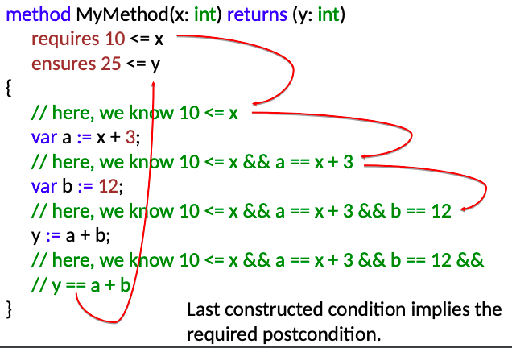
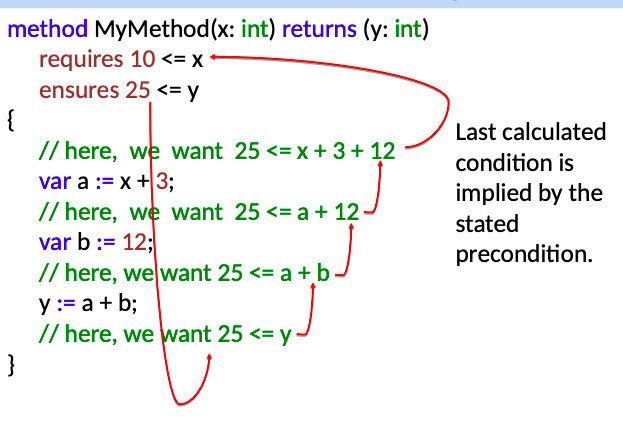

# C357 JANUARY 2019 EXAMINATION

只包含了2020 JANUARY没有的部分

## 2. 

### (a) A formula φ is written in propositional logic, explain the meaning of the following three statements:

1. φ is satisfiable. 
   1. φ is true in some model
2. φ is valid.
   1. φ true in every model (it is a tautology) 
3. φ is unsatisfiable
   1. φ unsatisfiable if it is false in every model

## 3.

### (a) Use an example to illustrate the difference between forward reasoning and backward reasoning. Why is backward reasoning often more useful than forward reasoning?

1. Forward reasoning:

2. Backward reasoning:

## 其他

### State what it means for a theory to have a sound proof system. Indicate how one could reason that a proof in propositional logic is sound.

A proof system is called **sound** if proving something syntactically means that it also follows logically

If we can get this proof in syntactically way but not in opposite, it is a sound proof system.

### In the context of propositional logic, use an example to illustrate each of the following terms:

1. Model : 一种取值的特殊情况
2. Satisfiability 
3. Validity 
4. Unsatisfiability