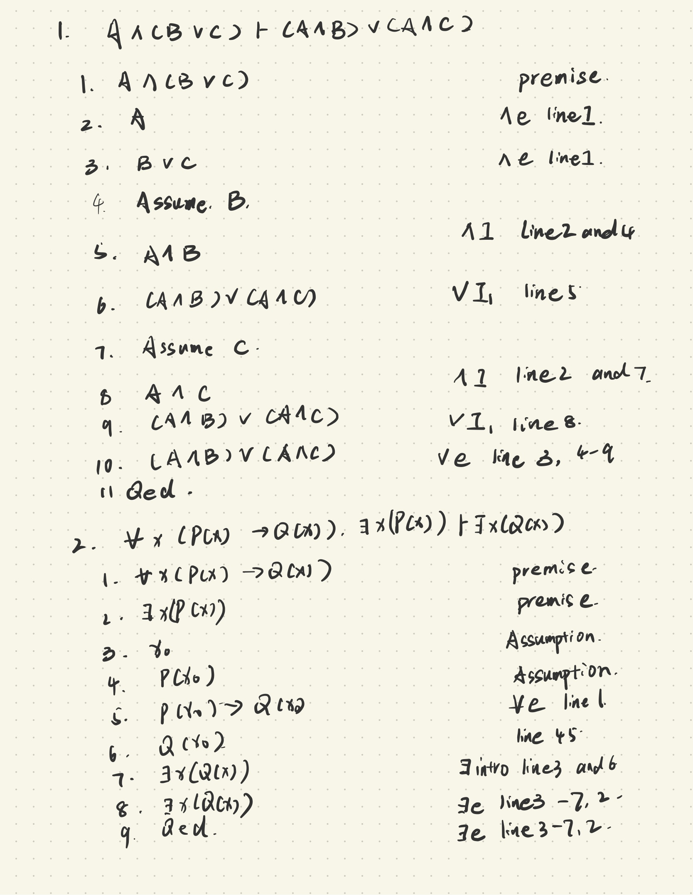
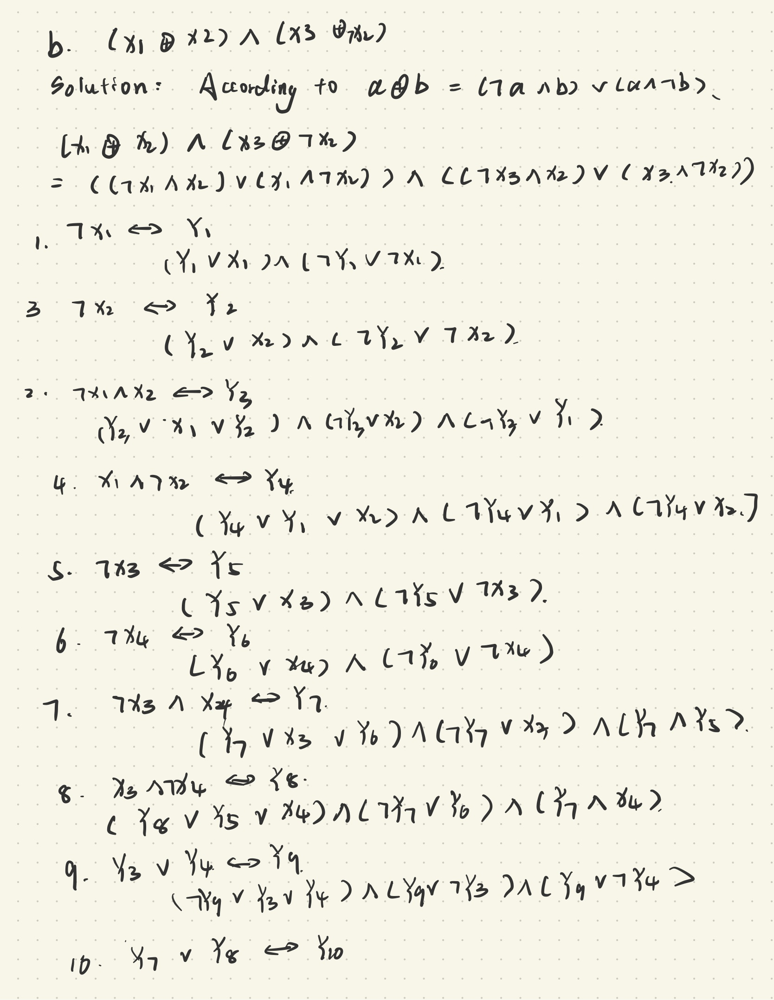
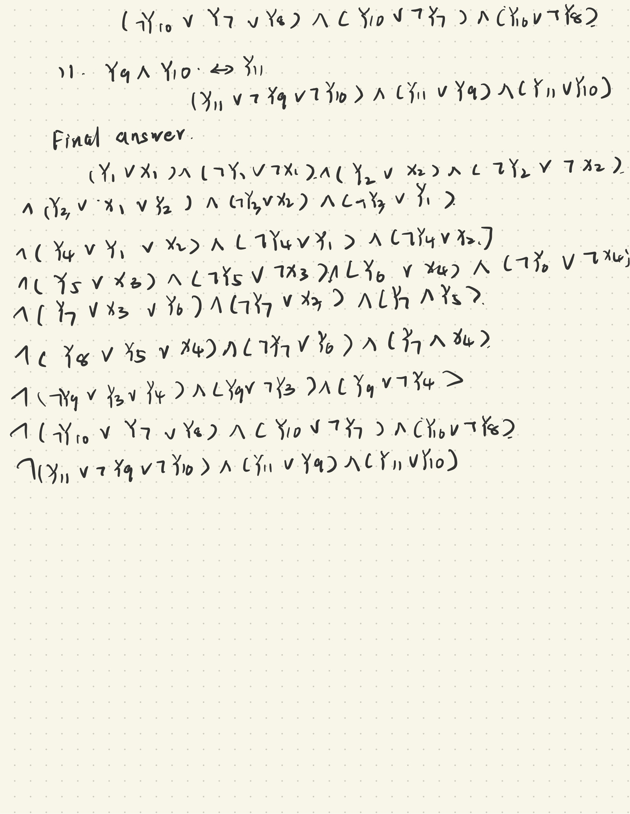
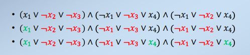
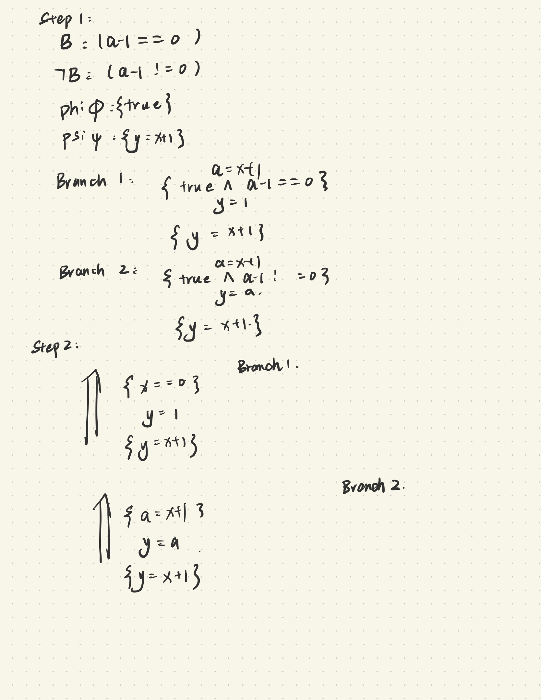
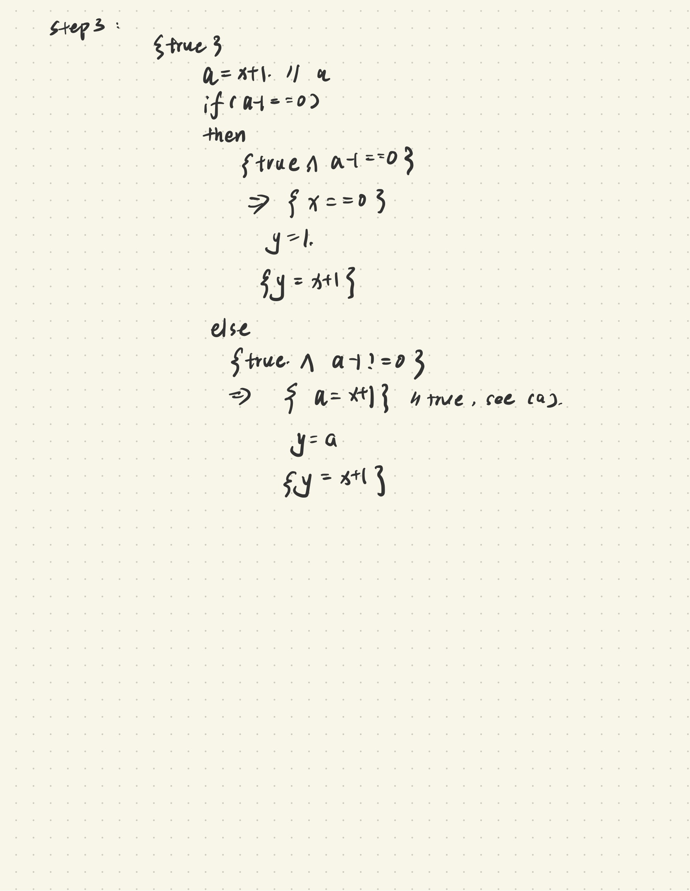

# C357 JANUARY 2020 EXAMINATION

## 1. 

### (a) Explain Design by Contract in terms of the roles of client and supplier. In the context of Design by Contract, what is the logical relationship between the contracts in a class and the contracts in any subclass of that class ?

1. - The supplier: Wrote the class code; documents it, maintains it; knows about the class implementation; publishes the class interface
   - The client: Uses the class in their own code; reads the documentation (presumably); knows about the class interface; knows nothing about the implementation

2. If A is a superclass of B: 

   1. B inherits all the (non-private) class invariants from A
   2. B may add a few of its own, either on: 
      1. the inherited variables, 
      2. or on new variables introduced by B 

   In logic terms, B’s class invariants must imply A’s class invariants.

### (b) Use natural deduction rules to prove the valdity of the following formulas.

1. A ∧ (B ∨ C) |- (A ∧ B) ∨ (A ∧ C)
2. ∀x(P(x) → Q(x)), ∃x(P(x)) |- ∃x(Q(x))



### (c) Explain precisely the difference between propositional logic and predicate logic. Provide examples to support your answer.

From Google: Propositional logic (also called sentential logic) is logic that includes sentence letters (A,B,C) and logical connectives, but not quantifiers. The semantics of propositional logic uses truth assignments to the letters to determine whether a compound propositional sentence is true.

For example: A, A→B, B→C |- C

Predicate logic is usually used as a synonym for first-order logic, but sometimes it is used to refer to other logics that have similar syntax. Syntactically, first-order logic has the same connectives as propositional logic, but it also has variables for individual objects, quantifiers, symbols for functions, and symbols for relations. The semantics include a domain of discourse for the variables and quantifiers to range over, along with interpretations of the relation and function symbols.

For example: (∀𝑥 (𝑃(𝑥) ∧ 𝑄(𝑥))) → (¬𝑃(𝑥) ∨ 𝑄(𝑦))

## 2. 

### (a)Given a proof system S , explain the meaning of the following four statements:

1. S is sound. 
   - Solution: A proof system is sound if it only allows us to prove things which are actually true.
2. S is complete. 
   - A proof system is complete if it allows us to prove all things which are actually true.
3. S is consistent.
   - A proof system is consistent if it never allows us to prove both 𝜙 and ¬𝜙 for any formula 𝜙
4. S is z.
   - A proof system is decidable if we can implement an algorithm* which, when given a formula 𝜙 as input will answer “yes” if 𝜙 is provable and “no” otherwise.

### (b) Given any propositional boolean formula, one can always convert it into CNF [9 marks] by using the following three rules:

- (a = ¬b) → (a ∨ b) ∧ (¬a ∨ ¬b)
- (a = b ∧ c) → (a ∨ ¬b ∨ ¬c) ∧ (¬a ∨ b) ∧ (¬a ∨ c)
- (a = b ∨ c) → (¬a ∨ b ∨ c) ∧ (a ∨ ¬b) ∧ (a ∨ ¬c)

Clearly show that how to convert the following boolean formula into CNF by using the rules above.

(x1 ⊕ x2) ∧ (x3 ⊕ ¬x2)

**Solution**: a⊕b = （¬a ∧ b） ∨ （a ∧¬b）




### (c) Outline the Davis-Putnam-Logemann-Loveland (DP LL) algorithm, your description should also explain each of the following terms with an example:

- Pure literals
  - Pure literal rule: clauses containing pure literals can be removed from the formula.
    - (𝑥4 ∨ ¬𝑥5) ∧ (𝑥5 ∨ ¬𝑥4)

- Unit clause
  - Unit clause rule: given a unit clause, its only unassigned literal must be assigned value 1.
    - (𝑥1 ∨ ¬𝑥2 ∨ ¬𝑥3), 𝑥3 must be assigned value 0.

- Unit propagation
  - Unit propagation: iterated application of the unit clause rule.
    - (𝑥1 ∨ ¬𝑥2 ∨ ¬𝑥3 ) ∧ (¬𝑥1 ∨ ¬𝑥3 ∨ 𝑥4) ∧ (¬𝑥1 ∨ ¬𝑥2 ∨ 𝑥4)
    - 


## 3. 

### (a) Use an example to illustrate the difference between proving partial and total correctness for a loop structure. To be precise, what is required in order to prove total correctness?

partial correctness requires that *if* an answer is returned it will be correct, is distinguished from total correctness, which additionally requires that an answer *is* eventually returned, i.e. the algorithm terminates.

Correspondingly, to prove a program's total correctness, it is sufficient to prove its partial correctness, and its termination

### (b) Use Hoare logic to verify the following program:

```dafny
a = x+1;
if (a-1 ==0){
	y=1;
}else{
	y=a;
}
```

The precondition here is T rue, and postcondition is y = x + 1.




### (c) Use Hoare logic to verify the partial correctness of the following program:

```dafny
a = x;
y = 0;
while (a!=0){
	y = y+1;
	a = a-1;
}
```

The precondition here is x ≥ 0, and postcondition is x = y.


## 4.

### (a) Explain the main difference between SAT solvers and SMT solvers.


### (b) Use Spec# annotations to write the pre/post condition(s) and loop invariant(s) for the following program.

```dafny
public static int fun (int[] a, int i, int j){
	int s =0;
	for (int n=i;n<j;n++) s+= a[n];
	return s;
}
```


### (c) Given the following predicates,

M arry(x, y) x is married to y. 

Love(x, y) x loves y.

use them to encode the following sentence into an SMT2 formula.

 If any two persons are married, then they must love each other.

### (d) Define each of the following verification goals and show how each property can be expressed in temporal logic:

- Reachability Property
- Safety Property
- Liveness Property