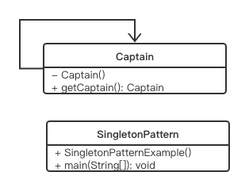

# Singleton Pattern

## Concept

A class cannot have multiple instances. Once created, the next time onward, you use only the existing instance. This approach helps you restrict unnecessary object creations in a centralized system. The approach also promotes easy maintenance.

## Characteristics

- The constructor is private to prevent the use of a “new” operator.
- You’ll create an instance of the class, if you did not create any such instance earlier; otherwise, you’ll simply reuse the existing one.
- To take care of thread safety, I use the “synchronized” keyword.

## UML



## Code

```java
public class SingletonPattern {
    public static void main(String[] arg) {
//        Captain captain = new Captain();//Not allowed
        Captain captain = Captain.getCaptain();
        System.out.println("Captain created");
        Captain captain1 = Captain.getCaptain();
        System.out.println("Trying to create another one");
        if(captain == captain1) {
            System.out.println("We create only one");
        }else {
            System.out.println("There are two!!");
        }
    }
}

class Captain {
    private static Captain captain;

    private Captain() {

    }

    public static synchronized Captain getCaptain() {
        if(captain == null) {
            captain = new Captain();
            System.out.println("Creating new class");
        }else {
            System.out.println("There exist one class, so we'll using the old one");
        }
        return captain;
    }
}
```

## Some question:

1. Why add `synchronized` before the `getCaptain()` function?

   1. In order to let this program work in multithreaded environment. In multithreaded environment, consider

      ```java
      if(captain == null)
      ```

      If there is two thread reach this code, they will find that there is no instance, so they all creating the instance. As a result, two instance will be created, which lead to a failure.

2. Why use lazy initialization in the code?

   1. Because the singleton instance will not be created until the getCaptain() method is called here.

3. What's lazy initialization?

   1. Lazy initialization is not to initialize the instance until needed. This approach can be helpful when you deal with expensive processes to create an object.

4. Why are you making the class final? 

   1. Although we use private for the constructor, when we create a new class which can extend the `Captain` class, it can also use the constructor, and create two different instances.

## Other Implement

### Eager Initialization

```java
class Captain {
  private static final Captain captain = new Captain();
  
  private Captain() {
    System.out.println("Instance created");
  }
  public static Captain getCaptain() {
    System.out.println("Instance has been created, use the old one");
    return captain;
  }
}
```

Pros: 

- It is straightforward and cleaner.
- It is the opposite of lazy initialization but still thread safe.
- It has a small lag time when the application is in execution mode because everything is already loaded in memory.

Cons: 

- The application takes longer to start (compared to lazy initialization) because everything needs to be loaded first.

### Bill Pugh's 

```java
class Captain1 {
  private Captain1() {
    System.out.println("A captain is elected for you team.");
  }
  private static class SingletonHelper {
    private static final Captain1 captain = new Captain1();
  }
  public static Captain1 getCaptain() {
    return SingletonHelper.captain;
  }
}
```

This method does not use a synchronization technique and eager initialization. Notice that the SingletonHelper class comes into consideration only when someone invokes the getCaptain() method. And this approach will not create any unwanted output if you just call any dummyMethod() from main(), as with the previous case (to examine the result, you need to uncomment the dummyMethod() body). It is also treated one of the common and standard methods for implementing singletons in Java.

### Double-Checked Locking

```java
final class Captain2 {
  private static Captain2 captain;
  static int numberOfInstance = 0;
  private Captain2() {
    numberOfInstance++;
    System.out.println("Number of instance at this moment="+numberofInstance);
  }
  public static Captain2 getCaptain() {
    if(captain == null) {
      synchronized(Captain2.class) {
        //Lazy initialization
        if(captain == null) {
          captain = new Captain2();
          System.out.println("New captain is elected for your team.");
        }else {
          System.out.print("You already have a captain for your team.");
          System.out.println("Send him for the toss");
        }
      }
    }
    return captain;
  }
}
```

If you notice our synchronized implementation of the singleton pattern, you may find that synchronization operations are costly in general and the approach is useful for some initial threads that might break the singleton implementation. But in later phases, the synchronization operations might create additional overhead. To avoid that problem, you can use a synchronized block inside an if condition, to ensure that no unwanted instance is created.

## When to consider singleton patterns?

- In real-world scenarios, object creations are treated as costly operations.
- Sometimes you need to implement a centralized system for easy maintenance, because it can help you provide a global access mechanism.
