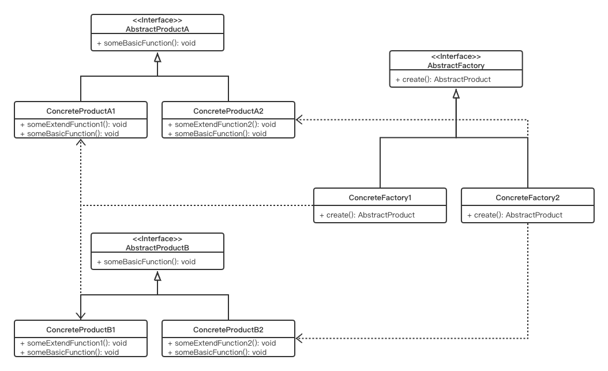

# Abstract Factory Pattern

## Concept

Provide an interface for creating families of related or dependent objects without specifying their concrete classes.

## Characters

与工厂方法模式相同，具体实现有差异

- AbstractFactory
- ConcreteFactory
- AbstractProduct
- ConcreteProduct

## UML



## Code

```java
public class AbstractFactoryPattern {
    public static void main(String[] args) {
        ChineseFactory nikeFactory = new NikeFactory();
        ChineseFactory LiNingFactory = new LiNingFactory();
        ChineseFactory AntaFactory = new AntaFactory();
        nikeFactory.createClothes().show();
        nikeFactory.createShoe().show();
        LiNingFactory.createClothes().show();
        LiNingFactory.createShoe().show();
        AntaFactory.createClothes().show();
        AntaFactory.createShoe().show();
    }
}

interface Shoe {
    public void show();
}

class NikeShoe implements Shoe {

    @Override
    public void show() {
        System.out.println("It's a Nike shoe");
    }
}

class LiNingShoe implements Shoe {

    @Override
    public void show() {
        System.out.println("It's a LiNing shoe");
    }
}

class AntaShoe implements Shoe {

    @Override
    public void show() {
        System.out.println("It's a AntaShoe shoe");
    }
}

interface Clothes {
    public void show();
}

class NikeClothes implements Clothes {

    @Override
    public void show() {
        System.out.println("It's a Nike clothes");
    }
}

class LiNingClothes implements Clothes {

    @Override
    public void show() {
        System.out.println("It's a LiNing clothes");
    }
}

class AntaClothes implements Clothes {

    @Override
    public void show() {
        System.out.println("It's a AntaShoe clothes");
    }
}

interface ChineseFactory {
    public Shoe createShoe();
    public Clothes createClothes();
}

class NikeFactory implements ChineseFactory{

    @Override
    public Shoe createShoe() {
        return new NikeShoe();
    }

    @Override
    public Clothes createClothes() {
        return new NikeClothes();
    }
}

class LiNingFactory implements ChineseFactory{

    @Override
    public Shoe createShoe() {
        return new LiNingShoe();
    }

    @Override
    public Clothes createClothes() {
        return new LiNingClothes();
    }
}

class AntaFactory implements ChineseFactory{

    @Override
    public Shoe createShoe() {
        return new AntaShoe();
    }

    @Override
    public Clothes createClothes() {
        return new AntaClothes();
    }
}
```

## Some Questions

1. Challenges

   - 抽象工厂更改会导致具体工厂的更改
   - 结构过于复杂，不方便debug

   

### 如何区分简单工厂、工厂方法和抽象工厂

简单工厂所有产品共享一个工厂，需要用if-else判断

工厂方法对每一个产品添加一个新工厂

抽象工厂对所有产品分组，对每一类产品的不同等级创建工厂


