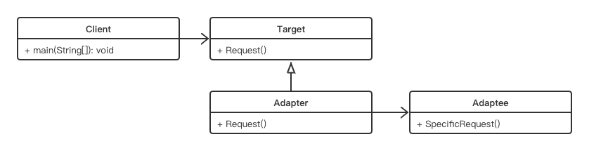

# Adapter Pattern

## Concept

Convert the interface of a class into another interface that clients expect. Adapter lets classes work together that could not otherwise because of incompatible interfaces.

## Characters

- Target（目标角色）
- Adaptee（源角色）
- Adapter（适配器角色）

## UML



## Code

```java
public class AdapterPattern {
    public static void main(String[] args) {
        ThreeHoleIf laptop = new Laptop();
        TwoHoleIf powerSocket = new PowerSocket();
        ChargeAdapter chargeAdapter = new ChargeAdapter(laptop, powerSocket);
        chargeAdapter.adapt();
    }
}

interface ThreeHoleIf {
    public void powerWithThree();
}

class Laptop implements ThreeHoleIf {

    @Override
    public void powerWithThree() {
        System.out.println("Charge with three");
    }
}

interface TwoHoleIf {
    public void powerWithTwo();
}

class PowerSocket implements TwoHoleIf {

    @Override
    public void powerWithTwo() {
        System.out.println("Power with two");
    }
}

class ChargeAdapter {
    ThreeHoleIf device;
    TwoHoleIf charger;
    public ChargeAdapter(ThreeHoleIf device, TwoHoleIf charger) {
        this.device = device;
        this.charger = charger;
    }
    public void adapt() {
        device.powerWithThree();
        charger.powerWithTwo();
    }
}
```

或者也可以使用继承来模拟。

## Some Questions

1. Which do you prefer—class adapters or object adapters?

   Object adapters use compositions and are more flexible. Also, in many cases, you may not implement a true class adapter. 

2. Disadvantages

   书里说没有，确实。。