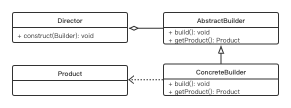

# Builder Pattern

## Concept

Separate the construction of a complex object from its representation so that the same construction processes can create different representations.

## Characters:

1. Product: 产品
2. Builder: 抽象构造者
3. ConcreteBuilder：具体构造者
4. Director: 决定如何构建最终产品的算法

## UML



## Code

```java
public class BuilderPattern {
    public static void main(String[] args) {
        ConcreteBuilder concreteBuilder = new ConcreteBuilder();
        Director director = new Director();
        User user = director.createUser(concreteBuilder,"Zhao", "Jianwei", 20, "18238378720");
        System.out.println(user.name);
    }
}

interface AbstractBuilder {
    public void buildAge(int age);
    public void buildName(String name);
    public void buildTel(String tel);
    public void getUser(String firstName);
    public User buildUser();
}

class ConcreteBuilder implements AbstractBuilder {
    public User user;

    @Override
    public void buildAge(int age) {
        user.age = age;
    }

    @Override
    public void buildName(String name) {
        user.name = name;
    }

    @Override
    public void buildTel(String tel) {
        user.telNumber = tel;
    }

    @Override
    public void getUser(String firstName) {
        user = new User(firstName);
    }

    @Override
    public User buildUser() {
        return this.user;
    }
}

//Abstract Product
final class User {
    public String firstName;
    public int age;
    public String name;
    public String telNumber;
    public User(String firstName) {
        this.firstName = firstName;
    }
}

class Director {
    User user;

    public User createUser(ConcreteBuilder abstractBuilder, String name, String firstName, int age, String telNumber) {
        abstractBuilder.getUser(firstName);
        abstractBuilder.buildAge(age);
        abstractBuilder.buildName(name);
        abstractBuilder.buildTel(telNumber);
        user = abstractBuilder.buildUser();
        return user;
    }
}
```

## Some Questions

1. Advantages

   - 对上层隐藏具体实现，只提供服务
   - 将建造过程拆分，在每一层都可自定，因此可以只用一个Director生产不同的product

2. Disadvantages

   - product生产之后不方便更改（因为上层不知道具体实现）
   - 每生产一种product，就需要一种builder
   - 对于简单的product有点小题大做

3. Why use a separate class for director? Can director be replaced by coding in main?

   额，这本书上说可以。

4. When consider using a builder pattern？

   If you need to make a complex object that involves various steps in the construction process, and at the same time, the products need to be immutable, the builder pattern is a good choice.