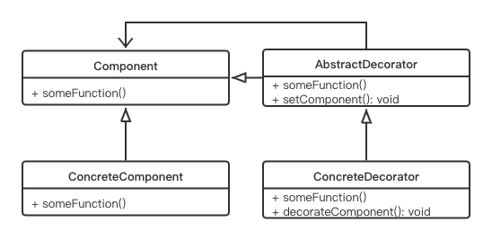

# Decorator Pattern

## Concept

Attach additional responsibilities to an object dynamically. Decorators provide a flexible alternative to subclassing for extending functionality.

## Characters

- AbstractComponent
- ConcreteComponent
- Decorator
- ConcreteDecorator

## UML



## Code

```java
public class DecoratorPattern {
    public static void main(String[] args) {
        ConcreteComponent withoutDecorator = new ConcreteComponent();
        withoutDecorator.makeHouse();
        FloorDecorator floorDecorator = new FloorDecorator();
        floorDecorator.setTheComponent(withoutDecorator);
        floorDecorator.makeHouse();
        PaintDecorator paintDecorator = new PaintDecorator();
        paintDecorator.setTheComponent(floorDecorator);
        paintDecorator.makeHouse();
    }
}

abstract class Component {
    public abstract void makeHouse();
}

class ConcreteComponent extends Component {

    @Override
    public void makeHouse() {
        System.out.println("Original House is complete. It is closed for\n" +
                "    modification.");
    }
}

abstract class AbstractDecorator extends Component {
    protected Component component;
    public void setTheComponent(Component c) {
        component = c;
    }
    public void makeHouse() {
        if(component != null) {
            component.makeHouse();
        }
    }
}

class FloorDecorator extends AbstractDecorator {
    public void makeHouse() {
        super.makeHouse();
        System.out.println("***Floor decorator is in action***");
        addFloor();
    }
    private void addFloor() {
        System.out.println("I am making an additional floor on top\n" +
                "of it.");
    }
}

class PaintDecorator extends AbstractDecorator {
    public void makeHouse() {
        super.makeHouse();
        System.out.println("***Paint decorator is in action now***");
        paintTheHouse();
    }
    private void paintTheHouse() {
        System.out.println("Now I am painting the house.");
    }
}
```

## Some Questions

1. Can you explain how composition is promoting a dynamic behavior that inheritance cannot?

   We know that when a derived class inherits from a parent class, it inherits the behavior of the base class at that time only. Though different subclasses can extend the base/parent class in different ways, this type of binding is known in compile-time, so the choice is static in nature. But the way that you used the concept of composition in the example lets you experiment with dynamic behavior.

   When we design a parent class, we may not have enough visibility about *what kind of additional responsibilities our clients may want in later phases*. And our constraint is that we should not modify the existing code frequently. In such a case, object composition not only outclasses inheritances, it also ensures that we are not introducing bugs to the existing architecture.

   Lastly, in this context, you must remember one of the key design principles: *Classes should be open for extension but closed for modification.*

2. Advantages

   - Will not add new bugs
   - Can add new function to old object
   - 迭代开发，可以实现MVP

3. 装饰器模式和继承的区别

   装饰器能够轻松的为多个类添加特性，同时并不会产生新的子类；如果使用继承来添加特性，当我需要同时为两个子类不同但父类相同的类添加相同的特性时，我需要生成两个继承类，因为在大部分的语言中，多继承是不允许的。同时，这样的做法也更加耗时、更加占用空间。

4. 为什么不把所有的新增功能放到同一个子类中？

   单一职责原则，每个类都应该对软件中的单个功能部分负责。当您使用单一责任原则时，decorator模式非常有效，因为您可以简单地动态添加/删除责任。

5. Disadvantages

   - 如果创建子类的装饰器太多了，维护和debug会很困难
