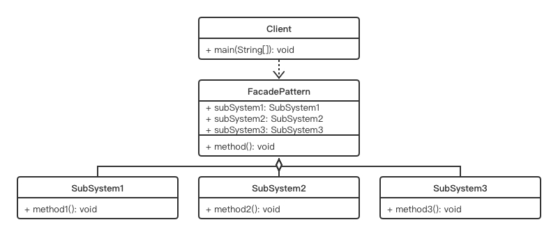

# Facade Pattern

## Concept

Provide a unified interface to a set of interfaces in a subsystem. Facade defines a higher- level interface that makes the subsystem easier to use.

## Characters

- Facade（外观）
- SubSystem（子系统）

## UML



## Code

```java
public class FacadePattern {
    public static void main(String[] args) {
        GiftExchangeService giftExchangeService = new GiftExchangeService();
        giftExchangeService.method();
    }
}

class Payment {
    public void method1() {
        System.out.println("Payment");
    }
}

class IntegralCalibration {
    public void method2() {
        System.out.println("IntegralCalibration");
    }
}

class Logistics {
    public void method3() {
        System.out.println("Logistics");
    }
}

class GiftExchangeService {
    Payment payment;
    IntegralCalibration integralCalibration;
    Logistics logistics;
    public GiftExchangeService() {
        payment = new Payment();
        integralCalibration = new IntegralCalibration();
        logistics = new Logistics();
    }
    public void method() {
        payment.method1();
        integralCalibration.method2();
        logistics.method3();
    }
}
```

## Some Questions

1. Advantages

   - 减少主方法需要调用的对象数量
   - 使单独调用对象和对象之间的通信变得简单‘

2. How is it different from adapter design pattern?

   - Adapter Pattern: Alter an interface so that the clients do not feel the difference between the interfaces.
   - Facade Pattern: Simplifies the interface. They present the client a simple interface to interact with 

3. There should be only one facade for a complex subsystem. Is this correct?

   Not at all. You can create any number of facades for a particular subsystem.

4. Challenges

   - 会增加代码层次（在系统与主方法调用之间增加一层外观）
   - 子系统更改，外观也需要去适配
   - 需要知道怎么使用外观的API

5. How is it different from the mediator design pattern?

   In a mediator pattern implementation, subsystems are aware of the mediator. They talk to each other. But in a facade, subsystems are not aware of the facade and the one-way communication is provided from facade to the subsystem(s).