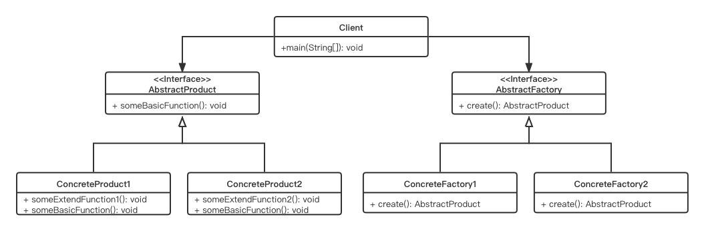

# Factory Method Pattern

## Concept

Define an interface for creating an object, but let subclasses decide which class to instantiate. Factory method lets a class defer instantiation to subclasses.

## Characters

1. AbstractProduct
2. ConcreteProduct
3. AbstractFactory
4. ConcreteFactory

## UML



## Code

```java
public class FactoryMethodPattern {
    public static void main(String[] args) {
        AbstractFactory concreteFactory1 = new ConcreteFactory1();
        AbstractFactory concreteFactory2 = new ConcreteFactory2();
        AbstractProduct concreteProduct1 = concreteFactory1.create();
        AbstractProduct concreteProduct2 = concreteFactory2.create();
        concreteProduct1.basicFunction();
        concreteProduct2.basicFunction();
    }
}

interface AbstractProduct {
    public void basicFunction();
}

class ConcreteProduct1 implements AbstractProduct {
    @Override
    public void basicFunction() {
        System.out.println("I'm a basic function1");
    }
}

class ConcreteProduct2 implements AbstractProduct {
    @Override
    public void basicFunction() {
        System.out.println("I'm a basic function2");
    }
}

interface AbstractFactory {
    public AbstractProduct create();
}

class ConcreteFactory1 implements AbstractFactory {

    @Override
    public AbstractProduct create() {
        return new ConcreteProduct1();
    }
}

class ConcreteFactory2 implements AbstractFactory {

    @Override
    public AbstractProduct create() {
        return new ConcreteProduct2();
    }
}
```

## Some Questions

1. Why separate the CreateAnimal() method from client code?

   I want the subclasses to create specialized objects.

2. Advantages

   - Separating code that can vary from the code that does not vary.
   - Followed the “closed for modification but open for extension” principle. You can extend the code very easy.

3. Disadvantages

   - If you need to deal with a large number of classes, then you may encounter maintenance overhead.\

