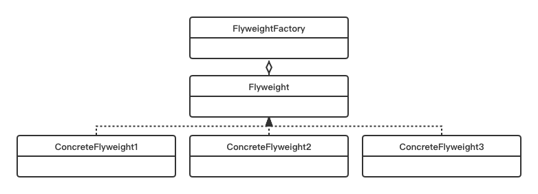

# Flyweight Pattern

## Concept

Use sharing to support large numbers of fine-grained objects efficiently.

## Characters

- Flyweight（抽象享元角色）
- ConcreteFlyweight（具体享元类）
- FlyweightFactory（享元工厂）

## UML



## Code

```java
public class FlyweightPattern {
    public static void main(String[] args) {
        ShapeFactory shapeFactory = new ShapeFactory();
        Shape greenCircle = shapeFactory.getCircle("Green");
        greenCircle.draw();
        Shape greenCircleAnother = shapeFactory.getCircle("Green");
        greenCircleAnother.draw();
    }
}

interface Shape {
    public void draw();
}

class Circle implements Shape {
    String color;
    public Circle(String color) {
        this.color = color;
    }
    @Override
    public void draw() {
        System.out.println("It's a circle in "+ color);
    }
}

class ShapeFactory {
    private HashMap<String, Circle> circleHashMap = new HashMap<String, Circle>();
    public Shape getCircle(String color) {
        if(circleHashMap.containsKey(color)){
            System.out.println("We use the old one");
            return circleHashMap.get(color);
        }else {
            System.out.println("We will create a new one");
            Circle circle = new Circle(color);
            circleHashMap.put(color, circle);
            return circle;
        }
    }
}
```

## Some Question

1. Difference between singleton pattern and flyweight pattern

   1. 享元模式可以添加很多大而重的对象
   2. 享元模式中，如果要属性不同的对象，可以创建新的对象并且返回；单例模式需要在原有对象上修改属性。

2. 享元模式和单例模式一样，也会收到多线程影响，且解决方法类似

3. Advantages

   - 较少创建大对象的内存消耗
   - 减少大而重对象的数量
   - 集中一个类控制对象

4. Challenges

   - 生成抽象享元和享元工厂的额外消耗
   - debug困难
   - 对线程保护造成的额外消耗

5. 可不可以有非享元的借口

   可以
