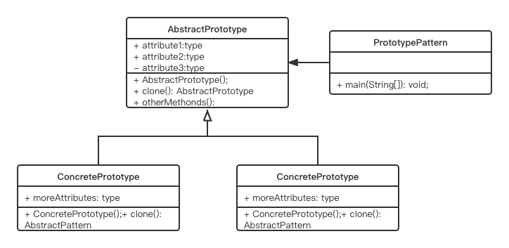

# Prototype Pattern

## Concept:

Create new instances by copying or cloning an instance of an existing one. 

## Characters:

1. Abstract Prototype
2. Concrete Prototype

## UML



## Code

```java
public class PrototypePattern {
    public static void main(String[] args) throws CloneNotSupportedException {
        AbstractPrototype prototype1 = new ConcretePrototype(1);
        AbstractPrototype prototype2 = prototype1.clone();
        prototype2.attribute = 5;
        System.out.println(prototype1.attribute);
        System.out.println(prototype2.attribute);
    }
}

abstract class AbstractPrototype implements Cloneable{
    int attribute;
    public void setAttribute(int attribute) {
        this.attribute = attribute;
    }
    public AbstractPrototype clone() throws CloneNotSupportedException{
        return (AbstractPrototype)super.clone();
    }
    public void otherMethods() {
        System.out.println("Other Methods");
    }
}

class ConcretePrototype extends AbstractPrototype{
    public ConcretePrototype(int moreAttr) {
        attribute = moreAttr;
    }
    public AbstractPrototype clone() throws CloneNotSupportedException {
        return (ConcretePrototype)super.clone();
    }
}
```

```shell
1
5
```

## Some Questions

1. Advantages?
   - You can create new instances at a cheaper cost.
   - It is useful when creating an instance of a class is a complicated (or boring) process. Instead, you can focus on other key activities.
   - You can include or discard products at runtime.
2. Challenges?
   - Implement cloning or copying

### Shallow copy and deep copy

A *shallow copy* creates a new object and then copies various field values from the original object to the new object. If the original object contains any references to other objects as fields, then the references of those objects are copied into the new object, you do not create the copies of those objects.

In a deep copy, the new object is totally separated from the original one. Any changes made in one object should not be reflected on the other one.

#### When shallow when deep?

If you target only has primitive fields, use shallow.

If you target comtains many fields that has reference to other objects, use deep.

