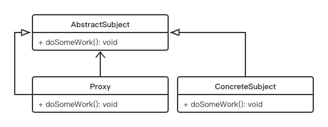

# Proxy Pattern

## Concept

Provide a surrogate or placeholder for another object to control access to it.

## Characters

1. AbstractSubject
2. ConcreteSubject
3. Proxy

## UML



## Code

```java
public class ProxyPattern {
    public static void main(String[] args) {
        ProxyImages proxy = new ProxyImages();
        proxy.display();
    }
}

interface Image {
    public void display();
}

class RealImage implements Image{

    @Override
    public void display() {
        System.out.println("Image has been loaded");
    }
}

class ProxyImages implements Image {

    static Image realImage;
    static String fileName = "RealImage";

    @Override
    public void display() {
        System.out.println("We're loading "+ fileName);
        if(realImage == null) {
            realImage = new RealImage();
        }
        realImage.display();
    }
}
```

## Some Questions

1. Different types of proxies

   1. *Remote proxies*. Hide the actual object that stays in a different address space.
   2. *Virtual proxies*. Perform optimization techniques, such as the creation of a heavy object on a demand basis.
   3. *Protection proxies*. Deal with different access rights.
   4. *Smart reference*. Performs additional housekeeping work when an object is accessed by a client. A typical operation is counting the number of references to the actual object at a particular moment.

2. When to use remote proxy?

   You want to call a method of an object but the object is running in a different address space. 

3. When to use virtual proxy?

   It can be used to avoid multiple loadings of an extremely large image.

4. When to use protection proxy?

   访问权限、安全访问等。

5. Different between **decorator pattern** and **proxy pattern**

   Decorator pattern is used to extend the function of the original class while proxy pattern is used to controlling the access to some file(Or do some work before access this file).

6. Disadvantages

   - May add up response time since you're not directly talking to the actual object.
   - You need to maintain additional code for the proxies.
   - A proxy can hide the actual responses from objects, which may create confusion in special scenarios.

   