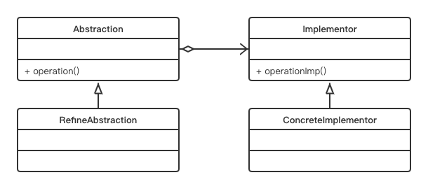

# Bridge Pattern

## Concept

Decouple an abstraction from its implementation so that the two can vary independently.

## Characters

- Abstraction（抽象化角色）
- RefinedAbstraction（修正抽象化角色）
- Implementor（实现化角色）
- ConcreteImplementor（具体实现化角色）

## UML



## Code

```java
public class BridgePattern {
    public static void main(String[] args) {
        Implementor imp = new ConcreteImplementorA();
        Abstraction abs = new RefinedAbstraction(imp);
        abs.request();
    }
}

abstract class Abstraction {
    private Implementor imp;

    public Abstraction(Implementor imp) {
        this.imp = imp;
    }

    public Implementor getImp() {
        return imp;
    }

    public void request() {
        this.imp.doSomething();
    }
}

abstract class Implementor {
    public abstract void doSomething();
    public abstract void doAnything();
}

class ConcreteImplementorA extends Implementor {

    @Override
    public void doSomething() {
        System.out.println("具体实现A的doSomething执行");
    }

    @Override
    public void doAnything() {
        System.out.println("具体实现A的doAnything执行");
    }
}

class RefinedAbstraction extends Abstraction {

    public RefinedAbstraction(Implementor imp) {
        super(imp);
    }

    @Override
    public void request() {
        super.request();
        super.getImp().doAnything();
    }
}
```

## Some Questions

1. Advantages
   - The implementations are not bound to the abstractions.
   - Abstractions and the implementations can grow independently.
   - Concrete classes are independent from the interface implementer classes
2. Challenges
   - The overall structure may become complex.
   - 与适配器模式过于相似（适配器模式的主要用途是仅处理不兼容的接口。）