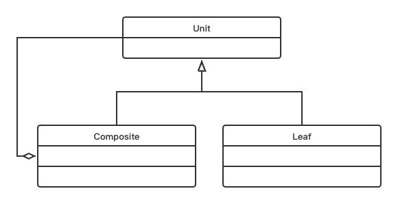

# Composite Pattern

## Concept

Compose objects into tree structures to represent part-whole hierarchies. Composite lets clients treat individual objects and compositions of objects uniformly.

## Characters

- Component（抽象构件）
- Leaf（角色构件）
- Composite（树枝构件）

## UML



## Code

```java
import java.util.ArrayList;
import java.util.List;

public class CompositePattern {
    public static void main(String[] args) {
        Employee CEO = new Employee("John", "CEO", 30000);

        Employee headSales = new Employee("Robert","Head Sales", 20000);

        Employee headMarketing = new Employee("Michel","Head Marketing", 20000);

        Employee clerk1 = new Employee("Laura","Marketing", 10000);
        Employee clerk2 = new Employee("Bob","Marketing", 10000);

        Employee salesExecutive1 = new Employee("Richard","Sales", 10000);
        Employee salesExecutive2 = new Employee("Rob","Sales", 10000);

        CEO.add(headSales);
        CEO.add(headMarketing);

        headSales.add(salesExecutive1);
        headSales.add(salesExecutive2);

        headMarketing.add(clerk1);
        headMarketing.add(clerk2);

        System.out.println(CEO);
        for(Employee headEmployee : CEO.getSubordinates()) {
            System.out.println(headEmployee);
            for(Employee employee : headEmployee.getSubordinates()) {
                System.out.println(employee);
            }
        }
    }
}

class Employee {
    private String name;
    private String dept;
    private int salary;
    private List<Employee> subordinates;

    public Employee(String name, String dept, int salary) {
        this.name = name;
        this.dept = dept;
        this.salary = salary;
        subordinates = new ArrayList<Employee>();
    }

    public void add(Employee e) {
        subordinates.add(e);
    }

    public void remove(Employee e) {
        subordinates.remove(e);
    }

    public List<Employee> getSubordinates() {
        return subordinates;
    }

    public String toString() {
        return ("Employee :[ Name : "+ name +", dept : "+ dept + ", salary :" + salary+" ]");
    }
}
```

## Some Questions

1. Advantages
   - 层次清晰
   - 添加和删除结构变得容易
   - 可以统一地处理所有分支
2. Challenges
   - 管理分支的额外工作
   - 如果叶子结点是可变量，不能直接删除
   - 大量的子类
3. 迭代器模式和组合模式可以复合使用，使用迭代器遍历数据结构的所有节点