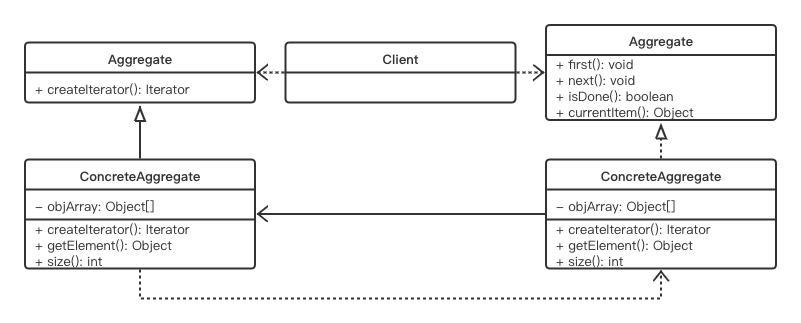

# Iterator Pattern

## Concept

Provide a way to access the elements of an aggregate object sequentially without exposing its underlying representation.

## Characters

- Iterator（抽象迭代器）：An interface to access or traverse elements.
- ConcreteIterator（具体迭代器）：Implements the Iterator interface methods. It can also keep track of the current position in the traversal of the aggregate.
- Aggregate（抽象迭代对象）：Defines an interface that can create an Iterator object.
- ConcreteAggregate（具体迭代对象）：Implements the Aggregate interface. It returns an instance of ConcreteIterator.

## UML



## Code

```java
public class IteratorPattern {
    public static void main(String[] args) {
        Subjects artsSubjects = new Arts();
        Iterator iteratorForArts = artsSubjects.createIterator();
        System.out.println("\n Arts subjects are as follows:");
        while(iteratorForArts.hasNext()) {
            System.out.println(iteratorForArts.next());
        }
        iteratorForArts.first();
        System.out.println("Currently pointing back to: "+ iteratorForArts.currentItem());
    }
}

interface Subjects {
    Iterator createIterator();
}

class Arts implements Subjects {

    private String[] papers;

    public Arts() {
        papers = new String[] {"English","History","Geography","Psychology"};
    }

    @Override
    public Iterator createIterator() {
        return new ArtsIterator(papers);
    }
}

interface Iterator {
    public void first();
    public String next();
    public String currentItem();
    public boolean hasNext();
}

class ArtsIterator implements Iterator {
    private String[] papers;
    private int position;
    public ArtsIterator(String[] papers) {
        this.papers = papers;
        position = 0;
    }

    @Override
    public void first() {
        position = 0;
    }

    @Override
    public String next() {
        return papers[position++];
    }

    @Override
    public String currentItem() {
        return papers[position];
    }

    @Override
    public boolean hasNext() {
        if(position >= papers.length)
            return false;
        return true;
    }
}
```

## Some Questions

1. What is the use of an iterator pattern?

   - You can traverse an object structure without knowing its internal details. 
   - You can traverse a collection in different ways. 

2. Challenges

   Ideally, during a traversal/iteration process, you should not perform any accidental modification to the core architecture.

3. But to deal with the challenge mentioned earlier, you could make a backup and then proceed. Is this correct?

   Making a backup and reexamining later is a costly operation.