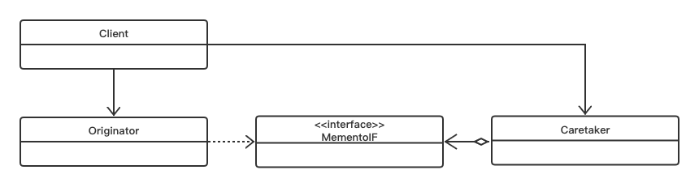

# Memento Pattern

## Concept

Without violating encapsulation, capture and externalize an object’s internal state so that the object can be restored to this state later.

## Characters

- Memento: 存储的内部状态;
- Originator: 创建一个备忘录并设置其状态；
- Caretaker：负责保存备忘录。

## UML



## Code

```java
public class experiment11_1 {
    public static void main(String[] args) {
        DietInfoCaretaker dietInfoCaretaker = new DietInfoCaretaker();
        DietInfo dietInfo = new DietInfo();
        dietInfo.personName = "Jianwei";
        dietInfo.days = 20;
        dietInfo.weight = 65;
        dietInfoCaretaker.saveState(dietInfo);
        System.out.println(dietInfo.personName+" "+dietInfo.days+" "+dietInfo.weight);
        dietInfo.personName = "Mzy";
        dietInfo.days = 20;
        dietInfo.weight = 49;
        System.out.println(dietInfo.personName+" "+dietInfo.days+" "+dietInfo.weight);
        dietInfoCaretaker.restoreState();
        System.out.println(dietInfo.personName+" "+dietInfo.days+" "+dietInfo.weight);
    }
}

class DietInfo {
    public String personName;
    public int days;
    public int weight;
    public DietInfoMemento dietInfoMemento;

    private class DietInfoMemento extends Object{
        public String personName;
        public int days;
        public int weight;

        public DietInfoMemento(String personName, int days, int weight) {
            this.personName = personName;
            this.days = days;
            this.weight = weight;
        }
    }

    public DietInfoMemento save() {
        return new DietInfoMemento(this.personName, this.days, this.weight);
    }

    public void restore(DietInfoMemento dietInfoMemento) {
        this.personName = dietInfoMemento.personName;
        this.days = dietInfoMemento.days;
        this.weight = dietInfoMemento.weight;
    }
}

class DietInfoCaretaker {

    public DietInfo dietInfo = new DietInfo();

    public void saveState(DietInfo dietInfo) {
        this.dietInfo = dietInfo;
        dietInfo.dietInfoMemento = dietInfo.save();
    }

    public void restoreState() {
        dietInfo.restore(this.dietInfo.dietInfoMemento);
    }
}
```

