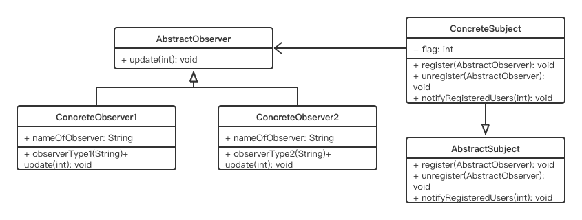
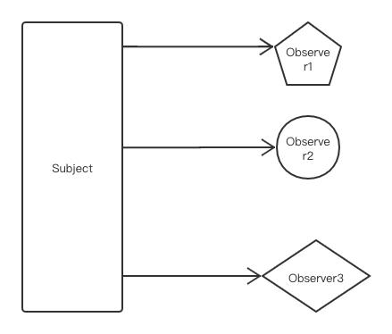
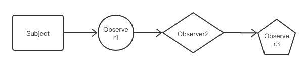

# Observer Pattern

## Concept

Define a one-to-many dependency between objects so that when one object changes state, all its dependents are notified and updated automatically.

## Characters

- AbstractObserver（抽象观察者）
- AbstractSubject（抽象被观察者）
- ConcreteObserver（具体观察者）
- ConcreteSubject（具体被观察者）

## UML



## Code

```java
import java.util.ArrayList;
import java.util.List;

public class ObserverPattern {
    public static void main(String[] args) {
        Observer ob1 = new ObserverType1("wuhu");
        Observer ob2 = new ObserverType1("DSM");
        Observer ob3 = new ObserverType2("tomas");
        Subject subject = new Subject();
        subject.register(ob1);
        subject.register(ob2);
        subject.register(ob3);
        subject.setFlag(5);
        subject.unregister(ob1);
        subject.setFlag(50);
    }
}

interface Observer {
    public void update(int updatedValue);
}

class ObserverType1 implements Observer {

    String nameOfObserver;

    public ObserverType1(String name) {
        nameOfObserver = name;
    }

    @Override
    public void update(int updatedValue) {
        System.out.println( nameOfObserver+" has received an alert: Updated myValue in Subject is: "+ updatedValue);
    }
}

class ObserverType2 implements Observer {

    String nameOfObserver;

    public ObserverType2(String name) {
        nameOfObserver = name;
    }

    @Override
    public void update(int updatedValue) {
        System.out.println( nameOfObserver+" has received an alert: Updated myValue in Subject is: "+ updatedValue);
    }
}

interface AbstractSubject {
    public void register(Observer observer);
    public void unregister(Observer observer);
    public void notifyRegisteredUsers(int notifyValue);
}

class Subject implements AbstractSubject {

    public int getFlag() {
        return flag;
    }

    public void setFlag(int flag) {
        this.flag = flag;
        notifyRegisteredUsers(flag);
    }

    List<Observer> observerList = new ArrayList<Observer>();

    private int flag;

    @Override
    public void register(Observer observer) {
        observerList.add(observer);
    }

    @Override
    public void unregister(Observer observer) {
        observerList.remove(observer);
    }

    @Override
    public void notifyRegisteredUsers(int notifyValue) {
        observerList.forEach(observer -> {
            observer.update(notifyValue);
        });
    }
}
```

## Some Questions

1. Observer pattern and chain of responsibility pattern

   In an observer pattern, all registered users get notifications at the same time, but in a chain of responsibility pattern, objects in the chain are notified one by one, and this process continues until the object fully handles the notification.
   Observer: 
   
   Chain:
   
   
2. Advantages

   - Main and subject do not know each other
   - No modification is required in subjects when you add or remove an observer from its notification lists.
   - Also, you can independently add or remove observers at any time.

3. Challenges

   - 如果不及时取消注册，会造成内存泄漏
   - 通知顺序不确定