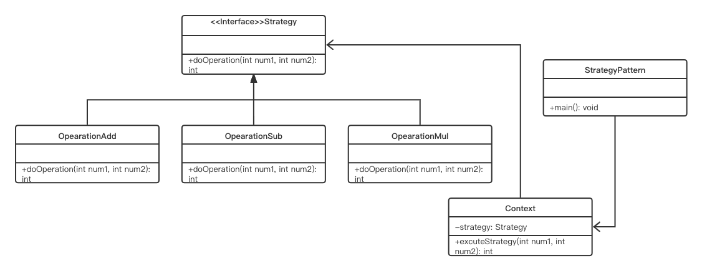

# Strategy Pattern

## Concept

Define a family of algorithms, encapsulate each one, and make them interchangeable. Strategy lets the algorithm vary independently from the clients that use it.

## Characters

- Context（环境）
- Strategy（抽象策略）
- ConcreteStrategy（具体策略）

## UML



## Code

```java
public class StrategyPattern {
    public static void main(String[] arg) {
        Context context = new Context();
        context.setOperation(new Add());
        context.doOperation(3,6);
    }
}

interface Operation {
    public int doOperation(int a, int b);
}

class Add implements Operation {

    @Override
    public int doOperation(int a, int b) {
        return a+b;
    }
}

class Sub implements Operation {

    @Override
    public int doOperation(int a, int b) {
        return a-b;
    }
}

class Mul implements Operation {

    @Override
    public int doOperation(int a, int b) {
        return a*b;
    }
}

class Context {
    private Operation operation;

    public void setOperation(Operation operation) {
        this.operation = operation;
    }

    public void doOperation(int a, int b) {
        System.out.println(a+" "+b+" after operation is "+this.operation.doOperation(a, b));
    }
}
```

## Some Qusetions

1. Advantages
   - This pattern makes your classes independent from algorithms
   - 可以随意扩展算法
2. Challenges
   - 更多对象
   - 必须使用对应的策略，造成客户端与策略的高耦合
   - 加入新算法时需要更改客户端代码