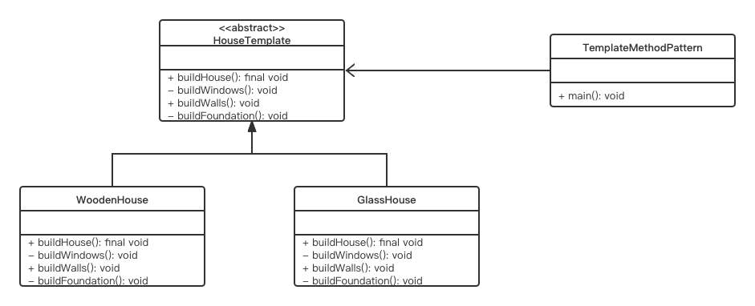

# Template Method Pattern

## Concept

Define the skeleton of an algorithm in an operation, deferring some steps to subclasses. Template method lets subclasses redefine certain steps of an algorithm without changing the algorithm’s structure.

## Characters

- AbstractTemplate（抽象模版）
- ConcreteTemplate（具体模版）

## UML



## Code

```java
public class TemplateMethodPattern {
    public static void main(String[]args) {
        HouseTemplate houseTemplate = new WoodenHouse();
        houseTemplate.buildHouse();
        System.out.println("*************************");
        houseTemplate = new GlassHouse();
        houseTemplate.buildHouse();
    }
}

abstract class HouseTemplate {
    //template method, final so subclasses can't override
    public final void buildHouse() {
        buildFoundation();

        buildWalls();

        buildWindows();
        System.out.println("House is built.");
    }

    //default implementation
    private void buildWindows() {
        System.out.println("Building Glass Windows");
    }

    //methods to be implemented by subclasses
    public abstract void buildWalls();

    private void buildFoundation() {
        System.out.println("Building foundation with cement,iron rods and sand");
    }
}

class WoodenHouse extends HouseTemplate{

    @Override
    public void buildWalls() {
        System.out.println("Building Wooden Walls");
    }
}

class GlassHouse extends HouseTemplate{

    @Override
    public void buildWalls() {
        System.out.println("Building Glass Walls");
    }
}
```

## Some Questions

1. 可以通过添加钩子方法来让子模版只执行部分模版的功能

2. 与建造者模式的区别

   Template Method is a behavioral design patterns, and Builder is a creational design pattern. In Builder Patterns, the clients/customers are the boss- they can control the order of the algorithm. On the other hand, in Template Method pattern, you are the boss-you put your code in a central location and you only provide the corresponding behavior (For example, notice the completeCourse() method in BasicEngineering and see how the course completion order is defined there).So, you have absolute control over the flow of the execution. You can also alter your template as per your need and then other participants need to follow you.

3. Advantages

   - You can control the flow of the algorithms. Clients cannot change them.
   - 抽象类的定义避免了冗余代码

4. Challenges

   - Client code cannot direct the sequence of steps (If you need that approach, you may follow the Builder pattern).
   - A subclass can override a method defined in the parent class
   - More subclass means more scattered codes and difficult maintenance.

