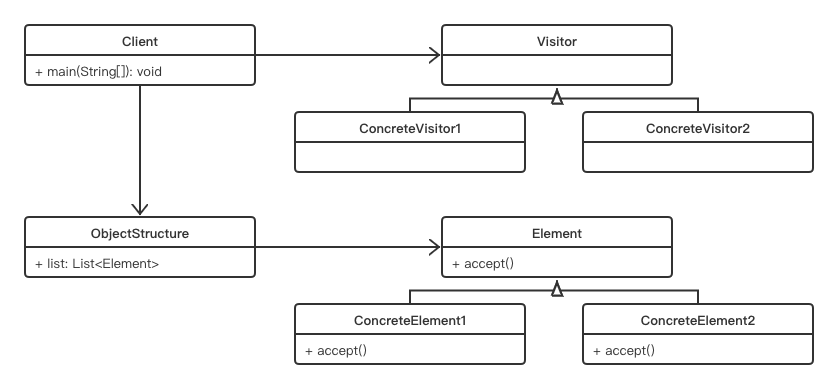

# Visitor Pattern

## Concept

Represent an operation to be performed on the elements of an object structure. Visitor lets you define a new operation without changing the classes of the elements on which it operates.

## Characters

1. Visitor（抽象访问者）：为该对象结构中具体元素角色声明一个访问操作接口。该操作接口的名字和参数标识了发送访问请求给具体访问者的具体元素角色，这样访问者就可以通过该元素角色的特定接口直接访问它。
2. ConcreteVisitor（具体访问者）：实现Visitor声明的接口。
3. Element（受访问元素）：定义一个接受访问操作，它以一个访问者作为参数
4. ConcreteElement（具体元素）：实现抽象元素所定义的接受操作接口
5. ObjectStructure（结构对象角色）：这是使用访问者模式必备的角色。它具备以下特性：能枚举它的元素；可以提供一个高层接口以允许访问者访问它的元素；如有需要，可以设计成一个复合对象或者一个聚集（如一个列表或无序集合）。

## UML

