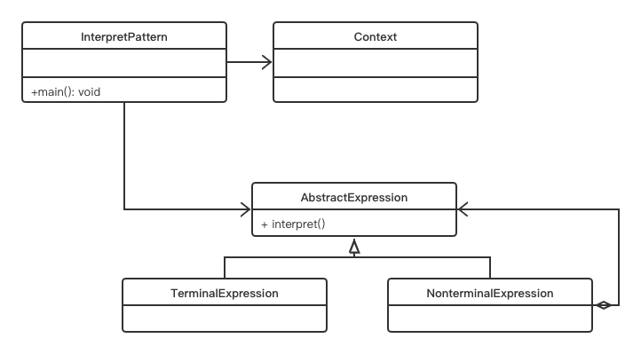

# 设计模式——解释器模式

## 定义：

解释器这个名词想必大家都不会陌生，比如编译原理中，一个算术表达式通过词法分析器形成词法单元，而后这些词法单元再通过语法分析器构建语法分析树，最终形成一颗抽象的语法分析树。诸如此类的例子也有很多，比如编译器、正则表达式等等。

如果一种特定类型的问题发生的频率足够高，那么可能就值得将该问题的各个实例表述为一个简单语言中的句子，这样就可以构建一个解释器，该解释器通过解释这些句子来解决该问题。

就比如正则表达式，它就是解释器模型的一种应用，解释器为正则表达式定义了一个文法，如何表示一个特定的正则表达式，以及如何解释这个正则表达式。

**解释器模式（Interpreter）**，给定一个语言，定义它的文法的一种表示，并定义一个解释器，这个解释器使用该表示来解释语言中的句子。

## 角色：

- 环境角色Context：用来声明一些全局信息
- 抽象表达式AbstractExpression：声明一个抽象的解释操作
- 终结符表达式TerminalExpression：代表语法的终结符
- 非终结符表达式NonterminalExpression：代表语法的非终结符

## UML

## 优点：

- 扩展性好：修改语法规则只需要修改相应的非终结符就可以了，若扩展语法，只需要增加非终结符类就可以了。

## 缺点：

- 解释器模式会引起类的膨胀：每个语法都需要产生一个非终结符表达式，语法规则比较复杂时，就可能产生大量的类文件，为维护带来非常多的麻烦。
- 解释器模式采用递归调用方法，将会导致调试非常复杂：每个非终结符表达式只关心与自己相关的表达式，每个表达式需要知道最终的结果，必须通过递归方式，无论是面向对象的语言还是面向过程的语言，递归都是一个不推荐的方式。
- 效率低：使用大量递归和循环，时间空间都不占优，特别是用于解释一个解析复杂、冗长的语法时，效率是难以忍受的。

