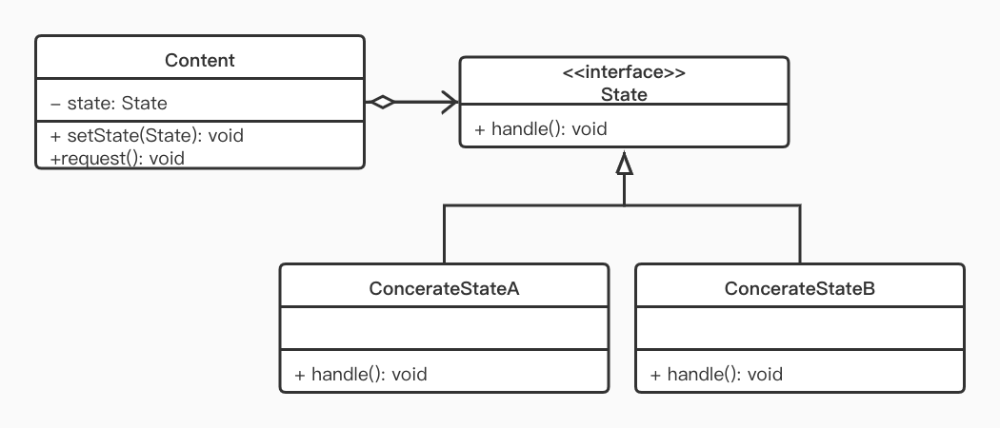

# 状态模式

## 模式用途

- 在很多情况下，一个对象的行为取决于一个或多个动态变化的属性，这样的属性叫做状态，这样的对象叫做有状态的(stateful)对象，这样的对象状态是从事先定义好的一系列值中取出的。当一个这样的对象与外部事件产生互动时，其内部状态就会改变，从而使得系统的行为也随之发生变化。
- 在UML中可以使用状态图来描述对象状态的变化。

## 模式定义

状态模式(State Pattern) ：允许一个对象在其内部状态改变时改变它的行为，对象看起来似乎修改了它的类。其别名为状态对象(Objects for States)，状态模式是一种对象行为型模式。

## 模式结构

状态模式包含如下角色：

- Context: 环境类
- State: 抽象状态类
- ConcreteState: 具体状态类

## UML类图

