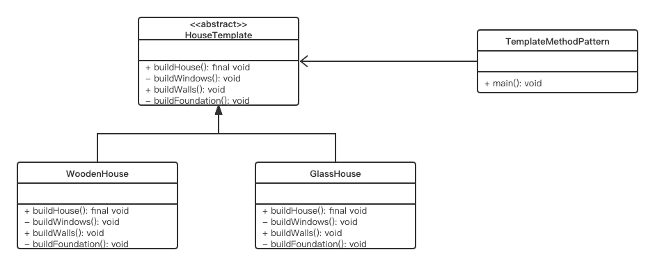

# 模版模式

在模板模式（Template Pattern）中，一个抽象类公开定义了执行它的方法的方式/模板。它的子类可以按需要重写方法实现，但调用将以抽象类中定义的方式进行。这种类型的设计模式属于行为型模式。

## 意图：

定义一个操作中的算法的骨架，而将一些步骤延迟到子类中。模板方法使得子类可以不改变一个算法的结构即可重定义该算法的某些特定步骤。

## 主要解决：

一些方法通用，却在每一个子类都重新写了这一方法。

## 何时使用：

有一些通用的方法。

## 优缺点：

### 优点

1. 封装不变部分，扩展可变部分；
2. 提取公共代码，便于维护；
3. 行为由父类控制，子类实现。

## 缺点

每一个不同的实现都需要一个子类来实现，导致类的个数增加，使得系统更加庞大

## UML类图:



## 代码实现：

根据上文的UML图，进行Java实现：

```java
package Week13;

public class TemplateMethodPattern {
    public static void main(String[]args) {
        HouseTemplate houseTemplate = new WoodenHouse();
        houseTemplate.buildHouse();
        System.out.println("*************************");
        houseTemplate = new GlassHouse();
        houseTemplate.buildHouse();
    }
}

abstract class HouseTemplate {
    //template method, final so subclasses can't override
    public final void buildHouse() {
        buildFoundation();

        buildWalls();

        buildWindows();
        System.out.println("House is built.");
    }

    //default implementation
    private void buildWindows() {
        System.out.println("Building Glass Windows");
    }

    //methods to be implemented by subclasses
    public abstract void buildWalls();

    private void buildFoundation() {
        System.out.println("Building foundation with cement,iron rods and sand");
    }
}

class WoodenHouse extends HouseTemplate{

    @Override
    public void buildWalls() {
        System.out.println("Building Wooden Walls");
    }
}

class GlassHouse extends HouseTemplate{

    @Override
    public void buildWalls() {
        System.out.println("Building Glass Walls");
    }
}
```

输出如下：

```shell
Building foundation with cement,iron rods and sand
Building Wooden Walls
Building Glass Windows
House is built.
*************************
Building foundation with cement,iron rods and sand
Building Glass Walls
Building Glass Windows
House is built.

Process finished with exit code 0
```

