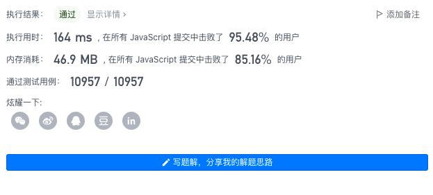

# Leetcode 秒杀题目合集

## 2021/12/12 [709. 转换成小写字母](https://leetcode-cn.com/problems/to-lower-case/)

给你一个字符串 `s` ，将该字符串中的大写字母转换成相同的小写字母，返回新的字符串。

 ### 示例

```away
输入：s = "Hello"
输出："hello"
```

一行搞定流重出江湖

```javascript
/**
 * @param {string} s
 * @return {string}
 */
var toLowerCase = function(s) {
    return s.toLocaleLowerCase();
};
```

## 2021/12/21 [1154. 一年中的第几天](https://leetcode-cn.com/problems/day-of-the-year/)

给你一个字符串 `date` ，按 `YYYY-MM-DD` 格式表示一个 [现行公元纪年法](https://baike.baidu.com/item/%E5%85%AC%E5%85%83/17855) 日期。请你计算并返回该日期是当年的第几天。

通常情况下，我们认为 1 月 1 日是每年的第 1 天，1 月 2 日是每年的第 2 天，依此类推。每个月的天数与现行公元纪年法（格里高利历）一致。

### 示例1:

```away
输入：date = "2019-01-09"
输出：9
```

### 示例2:

```away
输入：date = "2019-02-10"
输出：41
```

### 示例3:

```away
输入：date = "2003-03-01"
输出：60
```

### 示例4:

```away
输入：date = "2004-03-01"
输出：61
```

### 提示：

- `date.length == 10`
- `date[4] == date[7] == '-'`，其他的 `date[i]` 都是数字
- `date` 表示的范围从 1900 年 1 月 1 日至 2019 年 12 月 31 日

## 我的题解

模拟一下过日子，基本上都是这个思路

```javascript
/**
 * @param {string} date
 * @return {number}
 */
var dayOfYear = function(date) {
    var i;
    var year = parseInt(date.slice(0,4));
    var month = parseInt(date.slice(5,7));
    var day = parseInt(date.slice(8));
    for(i=1; i<month; i++) {
        if(i===1||i===3||i===5||i===7||i==8||i===10||i===12) {
            day+=31;
        }else if(i===4||i===6||i===9||i==11) {
            day+=30;
        }else if(((year%4 === 0) && (year%100!=0)) || (year%400===0)) {
            day+=29
        }else {
            day+=28
        }
    }
    return day
};
```

### 运行结果

