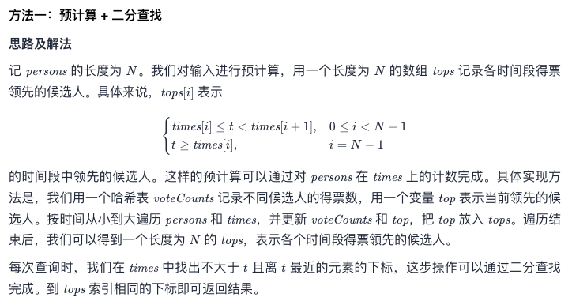

# Leetcode 每日一题 911. 在线选举

## 题目描述

给你两个整数数组 `persons` 和 `times` 。在选举中，第 `i` 张票是在时刻为 `times[i]` 时投给候选人 `persons[i]` 的。

对于发生在时刻 `t` 的每个查询，需要找出在 `t` 时刻在选举中领先的候选人的编号。

在 `t` 时刻投出的选票也将被计入我们的查询之中。在平局的情况下，最近获得投票的候选人将会获胜。

实现 `TopVotedCandidate` 类：

- `TopVotedCandidate(int[] persons, int[] times)` 使用 `persons` 和 `times` 数组初始化对象。
- `int q(int t)` 根据前面描述的规则，返回在时刻 t 在选举中领先的候选人的编号。

### 示例：

```away
输入：
["TopVotedCandidate", "q", "q", "q", "q", "q", "q"]
[[[0, 1, 1, 0, 0, 1, 0], [0, 5, 10, 15, 20, 25, 30]], [3], [12], [25], [15], [24], [8]]
输出：
[null, 0, 1, 1, 0, 0, 1]

解释：
TopVotedCandidate topVotedCandidate = new TopVotedCandidate([0, 1, 1, 0, 0, 1, 0], [0, 5, 10, 15, 20, 25, 30]);
topVotedCandidate.q(3); // 返回 0 ，在时刻 3 ，票数分布为 [0] ，编号为 0 的候选人领先。
topVotedCandidate.q(12); // 返回 1 ，在时刻 12 ，票数分布为 [0,1,1] ，编号为 1 的候选人领先。
topVotedCandidate.q(25); // 返回 1 ，在时刻 25 ，票数分布为 [0,1,1,0,0,1] ，编号为 1 的候选人领先。（在平局的情况下，1 是最近获得投票的候选人）。
topVotedCandidate.q(15); // 返回 0
topVotedCandidate.q(24); // 返回 0
topVotedCandidate.q(8); // 返回 1
```

### 提示：

- `1 <= persons.length <= 5000`
- `times.length == persons.length`
- `0 <= persons[i] < persons.length`
- `0 <= times[i] <= 109`
- `times` 是一个严格递增的有序数组
- `times[0] <= t <= 109`
- 每个测试用例最多调用 `10的4次方` 次 `q`

链接： https://leetcode-cn.com/problems/online-election/

## 我的题解

暴力通常能解决问题： 利用一个Set的特性找出所有的候选人编号，然后建一个等长的数组储存票数。在投票时间里找到不大于当前时刻的最大时刻，然后让指针递减统计票数。

当能够找到最多票数的人时，直接返回；若出现同票的情况，再次遍历投票时间的数组，找到同票候选人中，最后得票的那一个。

```javascript
/**
 * @param {number[]} persons
 * @param {number[]} times
 */
var TopVotedCandidate = function(persons, times) {
    this.persons = persons;
    this.times = times;
    this.perosonsCount = new Array(new Set(persons).size).fill(0)//利用集合的特性，找到所有候选人编号。
};

/** 
 * @param {number} t
 * @return {number}
 */
TopVotedCandidate.prototype.q = function(t) {
    var i;
    var k;
    var j;//指针
    for(i=0; i<this.times.length; i++) {
        if(t<this.times[i]) {
            break;
        }
    }//找到不大于当前时间的最大时间
    for(k=i-1; k>=0; k--) {
        this.perosonsCount[this.persons[k]]++;
    }//给每个候选人唱票
    max = 0;//用来记录得票最多候选人的编号
    for(j=0; j<this.perosonsCount.length; j++) {
        if(this.perosonsCount[j]>this.perosonsCount[max]) {
            max = j;
        }else if(this.perosonsCount[j]==this.perosonsCount[max]) {//如果同票，查找最近得票的候选人.
            for(k=i-1; k>=0; k--) {
                if(this.persons[k]==max) {
                    break;
                }
                if(this.persons[k]==j) {
                    max = j;
                    break;
                }
            }
        }
    }
    this.perosonsCount.fill(0);//让候选人票数清零，方便下次循环计票。
    return max;
};

/**
 * Your TopVotedCandidate object will be instantiated and called as such:
 * var obj = new TopVotedCandidate(persons, times)
 * var param_1 = obj.q(t)
 */
```

因为12月11日阿布扎比F1的大奖赛，我今天偷懒没有优化算法，回来想想还是有很多可以优化的地方，比如查找时间的时候可以用二分，或者用Map来代替用Set建造的数组等等，所以今天的运行结果也不是太好。。。


## 官方题解

### 预计算+二分法查找



这个计算思路和我差不多，只不过我忘记可以先把每个时间段领先的先算好再找时间了，失策了失策了。。。

```javascript
var TopVotedCandidate = function(persons, times) {
  this.tops = [];
  this.voteCounts = new Map();
  this.voteCounts.set(-1, -1);
  this.times = times;
  let top = -1;
  for(let i = 0; i< persons.length; ++i) {
    const p = persons[i];
    if(!this.voteCounts.has(p)) {
      this.voteCounts.set(p, 0);
    } else {
      this.voteCounts.set(p, this.voteCounts.get(p) + 1);
    }
    if(this.voteCounts.get(p) >= this.voteCounts.get(top)) {
      top = p;
    }
    this.tops.push(top);
  }
}
TopVotedCandidate.prototype.q = function(t) {
  let l = 0; r = this.times.length -1;
  while (l<r) {
    const m = 1 + Math.floor((r - 1 + 1) / 2);
    if(this.times[m] <= t) {
      l = m;
    } else {
      r = m - 1;
    }
  }
  return this.tops[l];
}
```

