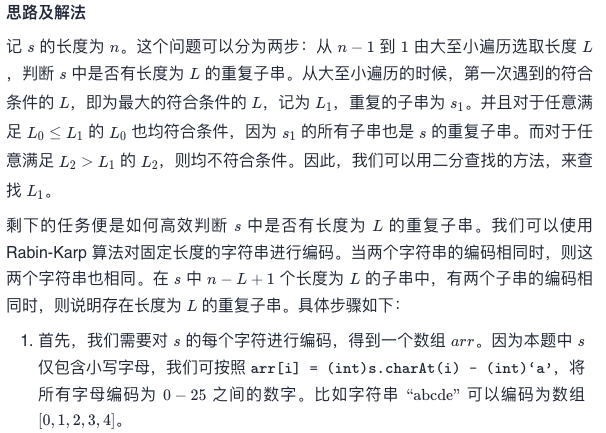
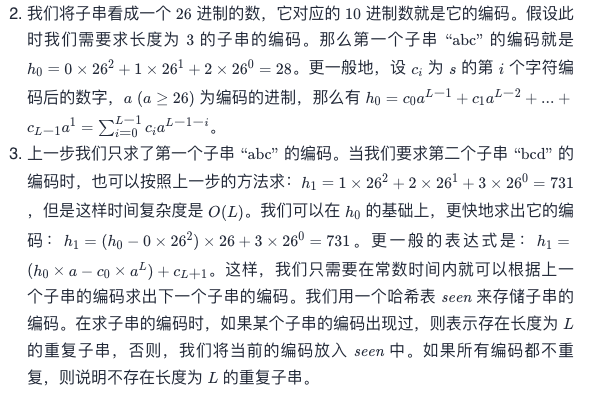
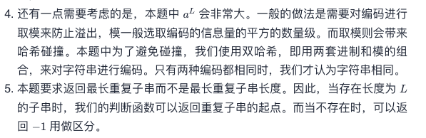

# Leetcode 每日一题 1044. 最长重复子串

## 题目描述

给你一个字符串 `s` ，考虑其所有 **重复子串** ：即，`s` 的连续子串，在 `s` 中出现 2 次或更多次。这些出现之间可能存在重叠。

返回 **任意一个** 可能具有最长长度的重复子串。如果 `s` 不含重复子串，那么答案为 "" 。

### 示例1:

```away
输入：s = "banana"
输出："ana"
```

### 示例2:

```away
输入：s = "abcd"
输出：""
```

### 提示：

- `2 <= s.length <= 3 * 104`
- `s` 由小写英文字母组成

链接：https://leetcode-cn.com/problems/longest-duplicate-substring/

## 我的题解

最近时间紧，本来打算遇到困难睡大觉，结果发现这写困难也是一件美逝。

我的解法，暴力，多谢js提供的多种多样的API，虽然API的算法我会写，但是这些API确实节省时间。

双指针，分别代表子串的头尾。匹配到可重复的字符串时，将尾+1继续匹配；如果没有匹配到，就把头+1。

```javascript
/**
 * @param {string} s
 * @return {string}
 */
var longestDupSubstring = function(s) {
    const n = s.length;
    var res = "";
    let maxLength = 0
    var i = 0;
    var j = 1;
    while(i<n) {
        const str = s.slice(i, j);
        if(s.indexOf(str)!=-1 && s.slice(i+1).indexOf(str)!=-1) {
            if(j-i>maxLength) {
                maxLength = j-i
                res = str
            }
            j+=1;
            i-=1;
        }
        i+=1;
    }
    return res;
};
```

### 运行结果


## 官方题解

### 方法一：二分查找 + Rabin-Karp 字符串编码







```java
class Solution {
    public String longestDupSubstring(String s) {
        Random random = new Random();
        // 生成两个进制
        int a1 = random.nextInt(75) + 26;
        int a2 = random.nextInt(75) + 26;
        // 生成两个模
        int mod1 = random.nextInt(Integer.MAX_VALUE - 1000000007 + 1) + 1000000007;
        int mod2 = random.nextInt(Integer.MAX_VALUE - 1000000007 + 1) + 1000000007;
        int n = s.length();
        // 先对所有字符进行编码
        int[] arr = new int[n];
        for (int i = 0; i < n; ++i) {
            arr[i] = s.charAt(i) - 'a';
        }
        // 二分查找的范围是[1, n-1]
        int l = 1, r = n - 1;
        int length = 0, start = -1;
        while (l <= r) {
            int m = l + (r - l + 1) / 2;
            int idx = check(arr, m, a1, a2, mod1, mod2);
            if (idx != -1) {
                // 有重复子串，移动左边界
                l = m + 1;
                length = m;
                start = idx;
            } else {
                // 无重复子串，移动右边界
                r = m - 1;
            }
        }
        return start != -1 ? s.substring(start, start + length) : "";
    }

    public int check(int[] arr, int m, int a1, int a2, int mod1, int mod2) {
        int n = arr.length;
        long aL1 = pow(a1, m, mod1);
        long aL2 = pow(a2, m, mod2);
        long h1 = 0, h2 = 0;
        for (int i = 0; i < m; ++i) {
            h1 = (h1 * a1 % mod1 + arr[i]) % mod1;
            h2 = (h2 * a2 % mod2 + arr[i]) % mod2;
            if (h1 < 0) {
                h1 += mod1;
            }
            if (h2 < 0) {
                h2 += mod2;
            }
        }
        // 存储一个编码组合是否出现过
        Set<Long> seen = new HashSet<Long>();
        seen.add(h1 * mod2 + h2);
        for (int start = 1; start <= n - m; ++start) {
            h1 = (h1 * a1 % mod1 - arr[start - 1] * aL1 % mod1 + arr[start + m - 1]) % mod1;
            h2 = (h2 * a2 % mod2 - arr[start - 1] * aL2 % mod2 + arr[start + m - 1]) % mod2;
            if (h1 < 0) {
                h1 += mod1;
            }
            if (h2 < 0) {
                h2 += mod2;
            }

            long num = h1 * mod2 + h2;
            // 如果重复，则返回重复串的起点
            if (!seen.add(num)) {
                return start;
            }
        }
        // 没有重复，则返回-1
        return -1;
    }

    public long pow(int a, int m, int mod) {
        long ans = 1;
        long contribute = a;
        while (m > 0) {
            if (m % 2 == 1) {
                ans = ans * contribute % mod;
                if (ans < 0) {
                    ans += mod;
                }
            }
            contribute = contribute * contribute % mod;
            if (contribute < 0) {
                contribute += mod;
            }
            m /= 2;
        }
        return ans;
    }
}

作者：LeetCode-Solution
```

