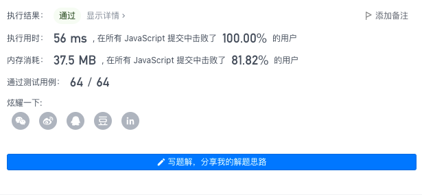

# Leetcode 每日一题 1518. 换酒问题

## 题目描述：

小区便利店正在促销，用 `numExchange` 个空酒瓶可以兑换一瓶新酒。你购入了 `numBottles` 瓶酒。

如果喝掉了酒瓶中的酒，那么酒瓶就会变成空的。

请你计算 **最多** 能喝到多少瓶酒。

### 示例1:


```away
输入：numBottles = 9, numExchange = 3
输出：13
解释：你可以用 3 个空酒瓶兑换 1 瓶酒。
所以最多能喝到 9 + 3 + 1 = 13 瓶酒。
```

### 示例2:


```away
输入：numBottles = 15, numExchange = 4
输出：19
解释：你可以用 4 个空酒瓶兑换 1 瓶酒。
所以最多能喝到 15 + 3 + 1 = 19 瓶酒。
```

### 示例3:

```away
输入：numBottles = 5, numExchange = 5
输出：6
```

### 示例4:

```away
输入：numBottles = 2, numExchange = 3
输出：2
```

### 提示：

- `1 <= numBottles <= 100`
- `2 <= numExchange <= 100`

链接：https://leetcode-cn.com/problems/water-bottles/

简单题？我重拳出击

## 我的题解

模拟整个过程，将每个过程计数就可以了

```javascript
var numWaterBottles = function(numBottles, numExchange) {
    var num = numBottles;
    var empty = numBottles;
    var cal = Math.floor(empty/numExchange)
    while(true) {
        num+=cal
        empty = empty - cal*numExchange + cal
        cal = Math.floor(empty/numExchange)
        if(cal==0) {
            break;
        }
    }
    return num;
};
```

### 运行结果



时间100%还不戳

## 官方题解

### 前言

记一开始有 *b* 瓶酒，*e* 个空瓶换一瓶酒。

### 方法一：模拟

```javascript
var numWaterBottles = function(numBottles, numExchange) {
    let bottle = numBottles, ans = numBottles;
    while (bottle >= numExchange) {
        bottle -= numExchange;
        ++ans;
        ++bottle;
    }
    return ans;
};

作者：LeetCode-Solution
```

### 方法二：数学

```javascript
var numWaterBottles = function(numBottles, numExchange) {
    return numBottles >= numExchange ? Math.floor((numBottles - numExchange) / (numExchange - 1)) + 1 + numBottles : numBottles;
};

作者：LeetCode-Solution
```

