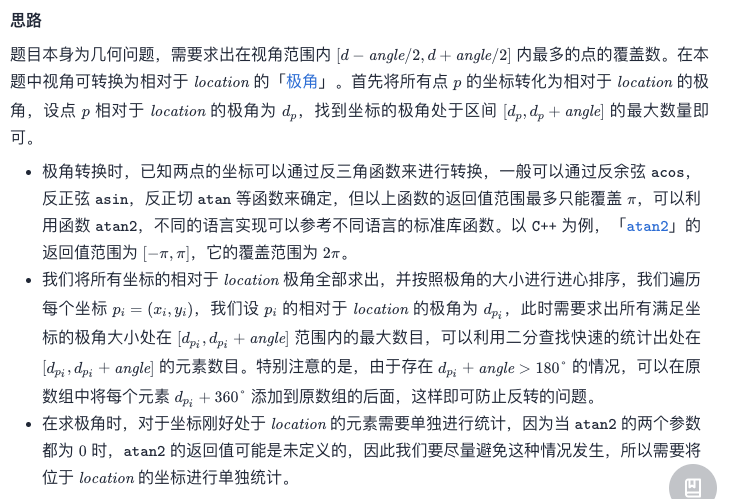
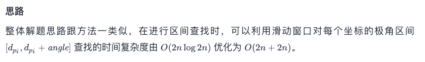

# Leetcode 每日一题 1610. 可见点的最大数目

## 题目描述

给你一个点数组 `points` 和一个表示角度的整数 `angle` ，你的位置是 `location` ，其中 `location = [posx, posy]` 且 `points[i] = [xi, yi]` 都表示 X-Y 平面上的整数坐标。

最开始，你面向东方进行观测。你 **不能** 进行移动改变位置，但可以通过 **自转** 调整观测角度。换句话说，`posx` 和 `posy` 不能改变。你的视野范围的角度用 `angle` 表示， 这决定了你观测任意方向时可以多宽。设 `d` 为你逆时针自转旋转的度数，那么你的视野就是角度范围 `[d - angle/2, d + angle/2]` 所指示的那片区域。


对于每个点，如果由该点、你的位置以及从你的位置直接向东的方向形成的角度 位于你的视野中 ，那么你就可以看到它。

同一个坐标上可以有多个点。你所在的位置也可能存在一些点，但不管你的怎么旋转，总是可以看到这些点。同时，点不会阻碍你看到其他点。

返回你能看到的点的最大数目。

### 示例1:


```away
输入：points = [[2,1],[2,2],[3,3]], angle = 90, location = [1,1]
输出：3
解释：阴影区域代表你的视野。在你的视野中，所有的点都清晰可见，尽管 [2,2] 和 [3,3]在同一条直线上，你仍然可以看到 [3,3] 。
```

### 示例2:

```away
输入：points = [[2,1],[2,2],[3,4],[1,1]], angle = 90, location = [1,1]
输出：4
解释：在你的视野中，所有的点都清晰可见，包括你所在位置的那个点。
```

### 示例3：


```away
输入：points = [[1,0],[2,1]], angle = 13, location = [1,1]
输出：1
解释：如图所示，你只能看到两点之一。
```

### 提示：

- `1 <= points.length <= 105`
- `points[i].length == 2`
- `location.length == 2`
- `0 <= angle < 360`
- `0 <= posx, posy, xi, yi <= 100`

链接：https://leetcode-cn.com/problems/maximum-number-of-visible-points/

好家伙，第一次见题目带个视频的。。

## 我的题解：

思路很简单，算出坐标，遍历一边，找到范围内的点放入一个数组，然后最长的数组的长度就是答案。

但是，怎么实现着实困难，我超时了无数次，最后看了官方题解有了一点灵感。

1. 如何处理360和0:

   我们其实可以先把原本的度数放进一个数组，再遍历这个数组，将这个数组的所有数增加360再放进同一个数组，当范围最大值超过360是，就能够匹配到哪些原来是0之后的数了；

2. 如何解决超时：

   最快的查找是二分查找。

```javascript
var visiblePoints = function(points, angle, location) {
  var i;//指针
  var ans=0;//最后答案
  var self = 0;//与人位置相同的点的个数
  var pointsSorted = [];//排序、增加一圈后点的集合
  for(i=0; i<points.length; i++) {
    if(points[i].toString()===location.toString()) {
      self++;
      continue;
    }//过滤和人位置相同的点
    var origin = Math.atan2(points[i][0]-location[0], points[i][1]-location[1])/Math.PI*180;
    if(origin<0) {
      origin = 360+origin
    }
    pointsSorted.push(origin);
  }//将所有点坐标变为与人站位的角度值，与y轴平行向上为0；
  pointsSorted.sort((a, b) => a-b)//排序节省时间
  var m = pointsSorted.length;
  for(i=0; i<m; i++) {
    pointsSorted.push(pointsSorted[i]+360);
  }//将所有点加360放入排序好的数组
  for(i=0; i<m; i++) {
    var max = angle+pointsSorted[i];
    var temp =  binarySearch(pointsSorted, max, i)
    if(temp>ans) {
      ans = temp;
    }
  }
  return ans+self;
};

var binarySearch = function(pointsSorted, max, i) {
  var top = pointsSorted.length-1;
  var bot = i;
  var ans = pointsSorted.length;
  while(top>=bot) {
    var mid = Math.floor((top+bot)/2);
    if(pointsSorted[mid]>max) {
      top = mid -1;
      ans = mid-i;
    }else {
      bot = mid +1;
    }
  }
  return ans
}
```

### 运行结果：


典型的时间换空间了属于是

## 官方解法：

官方今天又分了两个解法

### 方法一：二分查找

大同小异了属于是，毕竟我借鉴的别人的方法

思路一样，实现方法略有不同



```javascript
var visiblePoints = function(points, angle, location) {
    let sameCnt = 0;
    const polarDegrees = [];
    let locationX = location[0];
    let locationY = location[1];
    for (let i = 0; i < points.length; ++i) {
        const x = points[i][0];
        const y = points[i][1];
        if (x === locationX && y === locationY) {
            sameCnt++;
            continue;
        }
        const degree = Math.atan2(y - locationY, x - locationX);
        polarDegrees.push(degree);
    }
    polarDegrees.sort((a, b) => a - b);

    const m = polarDegrees.length;
    for (let i = 0; i < m; ++i) {
        polarDegrees.push(polarDegrees[i] + Math.PI * 2);
    }

    let maxCnt = 0;
    const toDegree = angle * Math.PI / 180; 
    for (let i = 0; i < m; ++i) {
        const iteration = binarySearch(polarDegrees, polarDegrees[i] + toDegree, false);
        maxCnt = Math.max(maxCnt, iteration - i);
    }
    return maxCnt + sameCnt;
};

const binarySearch = (nums, target, lower) => {
    let left = 0, right = nums.length - 1;
    let ans = nums.length;
    while (left <= right) {
        const mid = Math.floor((left + right) / 2);
        if (nums[mid] > target || (lower && nums[mid] >= target)) {
            right = mid - 1;
            ans = mid;
        } else {
            left = mid + 1;
        }
    }
    return ans;
}

作者：LeetCode-Solution
```

### 方法二：滑动窗口



```javascript
var visiblePoints = function(points, angle, location) {
    let sameCnt = 0;
    const polarDegrees = [];
    let locationX = location[0];
    let locationY = location[1];
    for (let i = 0; i < points.length; ++i) {
        const x = points[i][0];
        const y = points[i][1];
        if (x === locationX && y === locationY) {
            sameCnt++;
            continue;
        }
        const degree = Math.atan2(y - locationY, x - locationX);
        polarDegrees.push(degree);
    }
    polarDegrees.sort((a, b) => a - b);

    const m = polarDegrees.length;
    for (let i = 0; i < m; ++i) {
        polarDegrees.push(polarDegrees[i] + 2 * Math.PI);
    }

    let maxCnt = 0;
    let right = 0;
    const toDegree = angle * Math.PI / 180;
    for (let i = 0; i < m; ++i) {
        const curr = polarDegrees[i] + toDegree;
        while (right < polarDegrees.length && polarDegrees[right] <= curr) {
            right++;
        }
        maxCnt = Math.max(maxCnt, right - i);
    }
    return maxCnt + sameCnt;
};

作者：LeetCode-Solution

```

