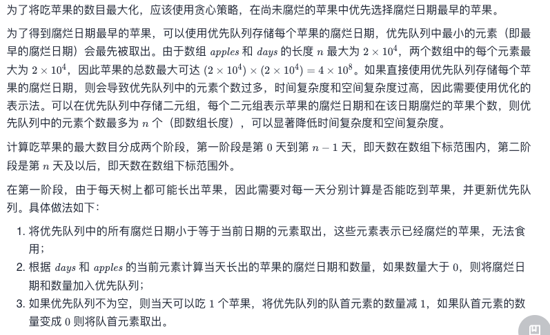
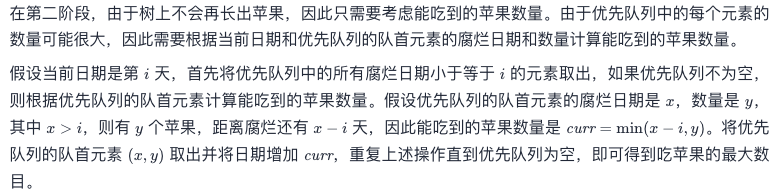

# Leetcode 每日一题 1705. 吃苹果的最大数目

## 题目描述

有一棵特殊的苹果树，一连 `n` 天，每天都可以长出若干个苹果。在第 `i` 天，树上会长出 `apples[i]` 个苹果，这些苹果将会在 `days[i]` 天后（也就是说，第 `i + days[i]` 天时）腐烂，变得无法食用。也可能有那么几天，树上不会长出新的苹果，此时用 `apples[i] == 0` 且 `days[i] == 0` 表示。

你打算每天 **最多** 吃一个苹果来保证营养均衡。注意，你可以在这 `n` 天之后继续吃苹果。

给你两个长度为 `n` 的整数数组 `days` 和 `apples` ，返回你可以吃掉的苹果的最大数目。

### 示例1:

```away
输入：apples = [1,2,3,5,2], days = [3,2,1,4,2]
输出：7
解释：你可以吃掉 7 个苹果：
- 第一天，你吃掉第一天长出来的苹果。
- 第二天，你吃掉一个第二天长出来的苹果。
- 第三天，你吃掉一个第二天长出来的苹果。过了这一天，第三天长出来的苹果就已经腐烂了。
- 第四天到第七天，你吃的都是第四天长出来的苹果。
```

### 示例2：

```away
输入：apples = [3,0,0,0,0,2], days = [3,0,0,0,0,2]
输出：5
解释：你可以吃掉 5 个苹果：
- 第一天到第三天，你吃的都是第一天长出来的苹果。
- 第四天和第五天不吃苹果。
- 第六天和第七天，你吃的都是第六天长出来的苹果。
```

### 提示：

- `apples.length == n`
- `days.length == n`
- `1 <= n <= 2 * 104`
- `0 <= apples[i], days[i] <= 2 * 104`
- 只有在 `apples[i] = 0` 时，`days[i] = 0` 才成立

链接：https://leetcode-cn.com/problems/maximum-number-of-eaten-apples/

## 我的题解

贪心+优先队列

```javascript
/**
 * @param {number[]} apples
 * @param {number[]} days
 * @return {number}
 */
var eatenApples = function (apples, days) {
    let res = 0, minDay = days[0] - 1;
    const freshArr = new Array(days.length).fill(0);
    for (let i = 0; i < freshArr.length; i++) {
        if (i < days.length && days[i] > 0) {
            freshArr[i + days[i] - 1] = (freshArr[i + days[i] - 1] || 0) + apples[i];
            minDay = Math.min(minDay, i + days[i] - 1);
        }
        minDay = Math.max(minDay, i);
        while (minDay < freshArr.length && !freshArr[minDay]) minDay++;
        if (freshArr[minDay]) res++, freshArr[minDay]--;
    }
    return res;
};
```

### 运行结果


## 官方题解

### 方法一：贪心 + 优先队列






```java
class Solution {
    public int eatenApples(int[] apples, int[] days) {
        int ans = 0;
        PriorityQueue<int[]> pq = new PriorityQueue<int[]>((a, b) -> a[0] - b[0]);
        int n = apples.length;
        int i = 0;
        while (i < n) {
            while (!pq.isEmpty() && pq.peek()[0] <= i) {
                pq.poll();
            }
            int rottenDay = i + days[i];
            int count = apples[i];
            if (count > 0) {
                pq.offer(new int[]{rottenDay, count});
            }
            if (!pq.isEmpty()) {
                int[] arr = pq.peek();
                arr[1]--;
                if (arr[1] == 0) {
                    pq.poll();
                }
                ans++;
            }
            i++;
        }
        while (!pq.isEmpty()) {
            while (!pq.isEmpty() && pq.peek()[0] <= i) {
                pq.poll();
            }
            if (pq.isEmpty()) {
                break;
            }
            int[] arr = pq.poll();
            int curr = Math.min(arr[0] - i, arr[1]);
            ans += curr;
            i += curr;
        }
        return ans;
    }
}
```

