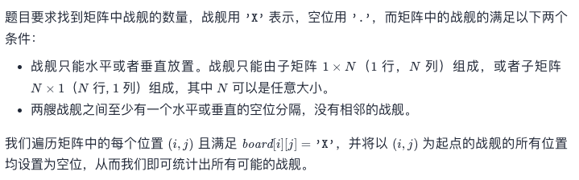
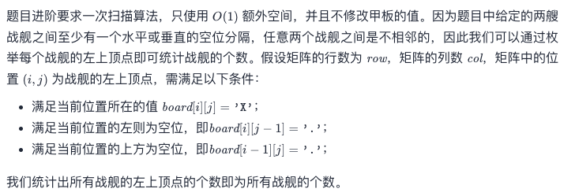

# Leetcode 每日一题 419. 甲板上的战舰

## 题目描述

给你一个大小为 `m x n` 的矩阵 `board` 表示甲板，其中，每个单元格可以是一艘战舰 `'X'` 或者是一个空位 `'.'` ，返回在甲板 `board` 上放置的 战舰 的数量。

战舰 只能水平或者垂直放置在 `board` 上。换句话说，战舰只能按 `1 x k`（`1` 行，`k` 列）或 `k x 1`（`k` 行，`1` 列）的形状建造，其中 `k` 可以是任意大小。两艘战舰之间至少有一个水平或垂直的空位分隔 （即没有相邻的战舰）。

### 示例1:


```away
输入：board = [["X",".",".","X"],[".",".",".","X"],[".",".",".","X"]]
输出：2
```

### 示例2:

```away
输入：board = [["."]]
输出：0
```

### 提示：

- `m == board.length`
- `n == board[i].length`
- `1 <= m, n <= 200`
- `board[i][j]` 是 `'.'` 或 `'X'`

### 进阶：

你可以实现一次扫描算法，并只使用 `O(1)` 额外空间，并且不修改 `board` 的值来解决这个问题吗？

链接：https://leetcode-cn.com/problems/battleships-in-a-board/

## 我的题解

将表全部扫描一遍，遇到`X`点就将其替换为`.`，并且同时扫描x和y两个延伸方向与该点连续的点，遇到`X`也替换为`.`, 第一次遇到`.`的时候就停止延伸，并且将战舰数量递增1

```javascript
/**
 * @param {character[][]} board
 * @return {number}
 */
var countBattleships = function(board) {
    var i;
    var j;
    var k;
    var bX = board.length;
    var bY = board[0].length;
    var count = 0;
    for(i=0; i<bX; i++) {
        for(j=0; j<bY; j++) {
            if(board[i][j]==="X") {
                board[i][j]="."
                for(k=i+1; k<bX&&board[k][j]==="X"; k++) {
                    board[k][j]="."
                }
                for(k=j+1; k<bY&&board[i][k]==="X"; k++) {
                    board[i][k]="."
                }
                count++;
            }
        }
    }
    return count;
};
```

### 运行结果：


## 官方题解：

### 方法1: 遍历扫描

这个方法和我的一模一样。



```c
int countBattleships(char** board, int boardSize, int* boardColSize){
    int row = boardSize;
    int col = boardColSize[0];
    int ans = 0;
    for (int i = 0; i < row; ++i) {
        for (int j = 0; j < col; ++j) {
            if (board[i][j] == 'X') {
                board[i][j] = '.';
                for (int k = j + 1; k < col && board[i][k] == 'X'; ++k) {
                    board[i][k] = '.';
                }                    
                for (int k = i + 1; k < row && board[k][j] == 'X'; ++k) {
                    board[k][j] = '.';
                }
                ans++;
            }
        }
    }
    return ans;
}

作者：LeetCode-Solution
```

### 方法2: 枚举起点

这个方法真的挺聪明的，我当时也想过用战舰的起点来计数，最后是因为代码能力没写出来，可惜



```c
int countBattleships(char** board, int boardSize, int* boardColSize){
    int row = boardSize;
    int col = boardColSize[0];
    int ans = 0;
    for (int i = 0; i < row; ++i) {
        for (int j = 0; j < col; ++j) {
            if (board[i][j] == 'X') {
                if (i > 0 && board[i - 1][j] == 'X') {
                    continue;
                }
                if (j > 0 && board[i][j - 1] == 'X') {
                    continue;
                }
                ans++;
            }
        }
    }
    return ans;
}

作者：LeetCode-Solution
```

🐮