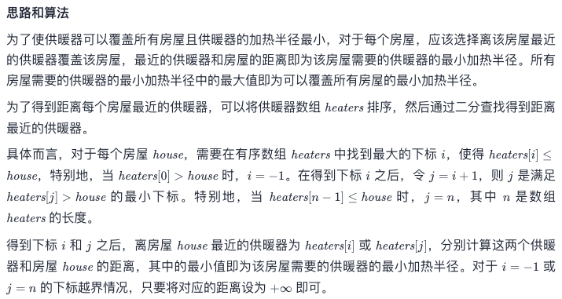
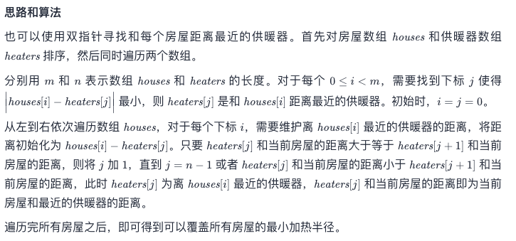
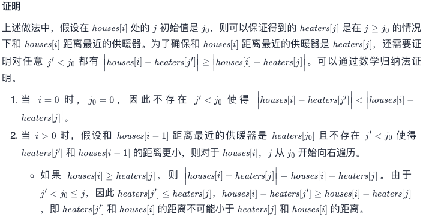
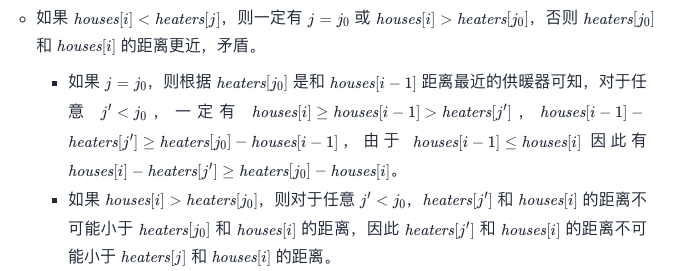
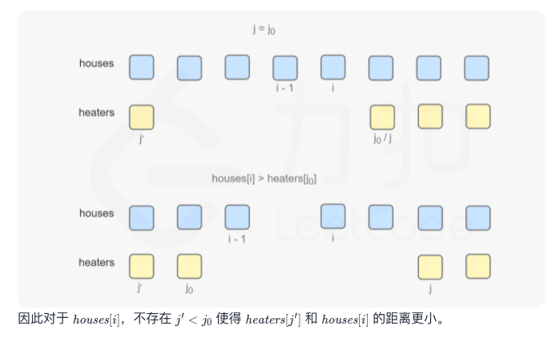

# Leetcode 每日一题 475. 供暖器

## 题目描述

冬季已经来临。 你的任务是设计一个有固定加热半径的供暖器向所有房屋供暖。

在加热器的加热半径范围内的每个房屋都可以获得供暖。

现在，给出位于一条水平线上的房屋 houses 和供暖器 heaters 的位置，请你找出并返回可以覆盖所有房屋的最小加热半径。

说明：所有供暖器都遵循你的半径标准，加热的半径也一样。

### 示例1:

```away
输入: houses = [1,2,3], heaters = [2]
输出: 1
解释: 仅在位置2上有一个供暖器。如果我们将加热半径设为1，那么所有房屋就都能得到供暖。
```

### 示例2：

```away
输入: houses = [1,2,3,4], heaters = [1,4]
输出: 1
解释: 在位置1, 4上有两个供暖器。我们需要将加热半径设为1，这样所有房屋就都能得到供暖。
```

### 示例3:

```away
输入：houses = [1,5], heaters = [2]
输出：3
```

### 提示：

- `1 <= houses.length, heaters.length <= 3 * 104`
- `1 <= houses[i], heaters[i] <= 109`

链接：https://leetcode-cn.com/problems/heaters/

正好实验室今天开了暖气

## 我的题解：

对于每一个房间，遍历所有heaters，找到距离最短的heaters，记录这个距离。然后找的这些房间最大的最短距离，就是答案

```javascript
/**
 * @param {number[]} houses
 * @param {number[]} heaters
 * @return {number}
 */
var findRadius = function(houses, heaters) {
  var i;
  var j;//指针
  var scale = 0;//距离
  for(i=0; i<houses.length; i++) {
      var min = Math.abs(houses[i]-heaters[0]);//初始化最短距离
    for(j=1; j<heaters.length; j++) {
        if(Math.abs(houses[i]-heaters[j])<min) {
            min = Math.abs(houses[i]-heaters[j]);
        }
    }//找到最短距离
    if(min>scale) {
        scale = min
    }//找到这些最短距离中的最大值
  }
  return scale;
};
```

### 运行结果：


## 官方题解：

### 方法一：



```c
#define MAX(a, b) ((a) > (b) ? (a) : (b))
#define MIN(a, b) ((a) < (b) ? (a) : (b))

int binarySearch(const int* nums, int numsSize, int target) {
    int left = 0, right = numsSize - 1;
    if (nums[left] > target) {
        return -1;
    }
    while (left < right) {
        int mid = (right - left + 1) / 2 + left;
        if (nums[mid] > target) {
            right = mid - 1;
        } else {
            left = mid;
        }
    }
    return left;
}

int cmp(const void* a, const void* b) {
    int* pa = (int*)a;
    int* pb = (int*)b;
    return *pa - *pb;
}

int findRadius(int* houses, int housesSize, int* heaters, int heatersSize){
    int ans = 0;
    qsort(heaters, heatersSize, sizeof(int), cmp);
    for (int k = 0; k < housesSize; ++k) {
        int i = binarySearch(heaters, heatersSize, houses[k]);
        int j = i + 1;
        int leftDistance = i < 0 ? INT_MAX : houses[k] - heaters[i];
        int rightDistance = j >= heatersSize ? INT_MAX : heaters[j] - houses[k];
        int curDistance = MIN(leftDistance, rightDistance);
        ans = MAX(ans, curDistance);
    }
    return ans;
}


作者：LeetCode-Solution
```

### 方法二：










```c
#define MAX(a, b) ((a) > (b) ? (a) : (b))
#define MIN(a, b) ((a) < (b) ? (a) : (b))

int binarySearch(const int* nums, int numsSize, int target) {
    int left = 0, right = numsSize - 1;
    if (nums[left] > target) {
        return -1;
    }
    while (left < right) {
        int mid = (right - left + 1) / 2 + left;
        if (nums[mid] > target) {
            right = mid - 1;
        } else {
            left = mid;
        }
    }
    return left;
}

int cmp(const void* a, const void* b) {
    int* pa = (int*)a;
    int* pb = (int*)b;
    return *pa - *pb;
}

int findRadius(int* houses, int housesSize, int* heaters, int heatersSize){
    int ans = 0;
    qsort(heaters, heatersSize, sizeof(int), cmp);
    for (int k = 0; k < housesSize; ++k) {
        int i = binarySearch(heaters, heatersSize, houses[k]);
        int j = i + 1;
        int leftDistance = i < 0 ? INT_MAX : houses[k] - heaters[i];
        int rightDistance = j >= heatersSize ? INT_MAX : heaters[j] - houses[k];
        int curDistance = MIN(leftDistance, rightDistance);
        ans = MAX(ans, curDistance);
    }
    return ans;
}


作者：LeetCode-Solution
```

