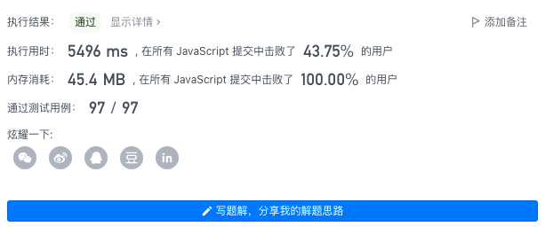
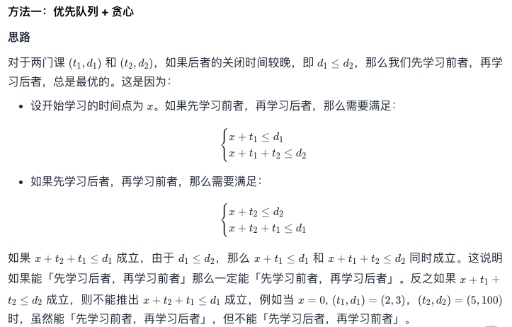
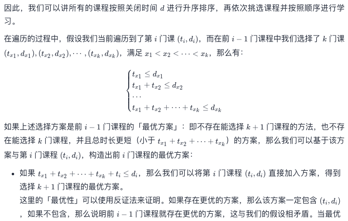
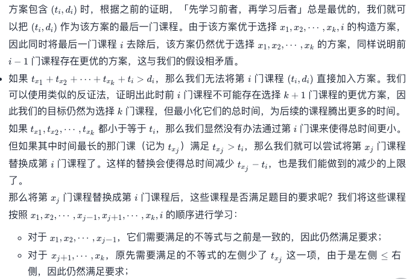
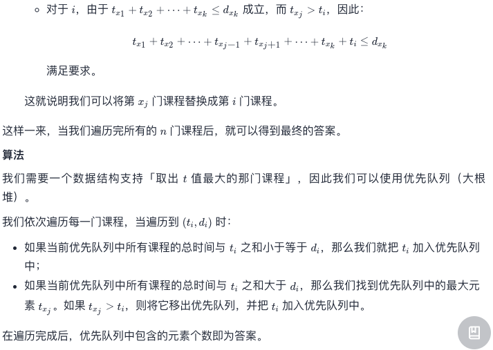

# Leetcode 每日一题 630. 课程表III

## 题目描述

这里有 `n` 门不同的在线课程，按从 `1` 到 `n` 编号。给你一个数组 `courses` ，其中 `courses[i] = [durationi, lastDayi]` 表示第 `i` 门课将会 持续 上 `durationi` 天课，并且必须在不晚于 `lastDayi` 的时候完成。

你的学期从第 `1` 天开始。且不能同时修读两门及两门以上的课程。

返回你最多可以修读的课程数目。

### 示例1:

```away
输入：courses = [[100, 200], [200, 1300], [1000, 1250], [2000, 3200]]
输出：3
解释：
这里一共有 4 门课程，但是你最多可以修 3 门：
首先，修第 1 门课，耗费 100 天，在第 100 天完成，在第 101 天开始下门课。
第二，修第 3 门课，耗费 1000 天，在第 1100 天完成，在第 1101 天开始下门课程。
第三，修第 2 门课，耗时 200 天，在第 1300 天完成。
第 4 门课现在不能修，因为将会在第 3300 天完成它，这已经超出了关闭日期。
```

### 示例2:

```away
输入：courses = [[1,2]]
输出：1
```

### 示例3:

```away
输入：courses = [[3,2],[4,3]]
输出：0
```

### 提示：

- `1 <= courses.length <= 104`
- `1 <= durationi, lastDayi <= 104`

## 我的题解：

一开始没想明白，看了看提示想出来了

1. 首先先去除不可能可以完成的任务（需要时间比deadline还长）
2. 将任务按照deadline升序排列
3. 开始学习，加入第一门课程
4. 加入第二门课程
   1. 如果第二门课程deadline时间超出了已经学习课程的时间和（包含第二门），找到已学习课程耗时最长的一门，如果这门课耗时比第二门课长，就用第二门课和这门课兑换，否则则跳过第二门课。
5. 学习第n门课程
   1. 如果第n门课程deadline时间超出了已经学习课程的时间和（包含第n门），找到已学习课程耗时最长的一门，如果这门课耗时比第n门课长，就用第n门课和这门课兑换，否则则跳过第n门课。

这样我们就找到了最满的课表（想哭🥲）

### 为什么可以这样找

为什么当前课程能直接替换掉前面的某一课程？
要能替换掉该课程，则所有的已选课程都要能在规定的`deadline`的时间内能学完
假设当前已选课程为`[A,B,C,D]`，然后要加入的课程为`E`，已知`B`的持续时长>`E`的持续时长，是否能使用`E`来替换掉`B` ?
对于`B`之前的数据显然没有影响
对于`B`之后的数据有
`CurTime替换前`>`CurTime替换后`
因为
`CurTime替换前+Time-c`<`End-c`
=>
`CurTime替换后+Time-c` < `End-c`
同理
`CurTime替换后+Time-d` < `End-d`
因此对于`B`之后的数据也没有影响，只是`CurTime`变小，留给之后安排的课程的时间变宽裕了

（这段从评论找的，讲的很明白）

```javascript
/**
 * @param {number[][]} courses
 * @return {number}
 */
var scheduleCourse = function(courses) {
  var i;
  var j;//指针
  var validCourse = [];//有效课程
  var time = 0;//已花费时间
  var result = [];//最终课表
  var timeConsumer = 0;//课标中最耗时课程的位置
  for(i=0; i<courses.length; i++) {
      if(courses[i][0]<=courses[i][1]) {
          validCourse.push(courses[i]);
      }
  }//去掉那些不可能可以完成的任务（需要时间比deadline还长）
  for(i=0; i<validCourse.length; i++) {
    for(j=i; j<validCourse.length; j++) {
        if(validCourse[i][1]>validCourse[j][1]) {
            temp = validCourse[i];
            validCourse[i] = validCourse[j];
            validCourse[j] = temp;
        }
    }
  }//将任务按照deadline升序排列
  for(i=0; i<validCourse.length; i++) {
    if(time+validCourse[i][0]>validCourse[i][1]) {//如果当前课程时间超过了deadline时间
      for(j=0; j<result.length; j++) {//找到当前课表中最耗时的课程
        if(result[timeConsumer][0]<result[j][0]) {
          timeConsumer = j;
        }
      }
      if(result[timeConsumer][0]>validCourse[i][0]) {
        time-=result[timeConsumer][0];
        result[timeConsumer] = validCourse[i];
        time+=result[timeConsumer][0];
      }//如果这门课比当前课程还耗时，就用当前课替换掉最耗时的课程
    }else {//如果deadline还没到，老师我还能学！！！
      result.push(validCourse[i]);
      time+=validCourse[i][0];
    }
  }
  return result.length;
};
```

最后运行空间100%



## 官方题解

官方和我一样。。就不过多解释了，截几张图吧






```java
class Solution {
    public int scheduleCourse(int[][] courses) {
        Arrays.sort(courses, (a, b) -> a[1] - b[1]);

        PriorityQueue<Integer> q = new PriorityQueue<Integer>((a, b) -> b - a);
        // 优先队列中所有课程的总时间
        int total = 0;

        for (int[] course : courses) {
            int ti = course[0], di = course[1];
            if (total + ti <= di) {
                total += ti;
                q.offer(ti);
            } else if (!q.isEmpty() && q.peek() > ti) {
                total -= q.poll() - ti;
                q.offer(ti);
            }
        }

        return q.size();
    }
}
作者：LeetCode-Solution
```

不得不说，代码比我简洁多了，请叫我屎山制造机！