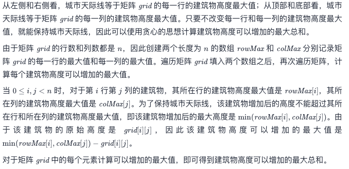

# Leetcode 每日一题 807. 保持城市天际线

## 题目描述

给你一座由 `n x n` 个街区组成的城市，每个街区都包含一座立方体建筑。给你一个下标从 0 开始的 `n x n` 整数矩阵 `grid` ，其中 `grid[r][c]` 表示坐落于 `r` 行 `c` 列的建筑物的 **高度** 。

城市的 **天际线** 是从远处观察城市时，所有建筑物形成的外部轮廓。从东、南、西、北四个主要方向观测到的 **天际线** 可能不同。

我们被允许为 **任意数量的建筑物** 的高度增加 **任意增量（不同建筑物的增量可能不同）** 。 高度为 `0` 的建筑物的高度也可以增加。然而，增加的建筑物高度 **不能影响** 从任何主要方向观察城市得到的 **天际线** 。

在 **不改变** 从任何主要方向观测到的城市 **天际线** 的前提下，返回建筑物可以增加的 **最大高度增量总和** 。

### 示例1：


```away
输入：grid = [[3,0,8,4],[2,4,5,7],[9,2,6,3],[0,3,1,0]]
输出：35
解释：建筑物的高度如上图中心所示。
用红色绘制从不同方向观看得到的天际线。
在不影响天际线的情况下，增加建筑物的高度：
gridNew = [ [8, 4, 8, 7],
            [7, 4, 7, 7],
            [9, 4, 8, 7],
            [3, 3, 3, 3] ]
```

### 示例2:

```away
输入：grid = [[0,0,0],[0,0,0],[0,0,0]]
输出：0
解释：增加任何建筑物的高度都会导致天际线的变化。
```

### 提示：

- `n == grid.length`
- `n == grid[r].length`
- `2 <= n <= 50`
- `0 <= grid[r][c] <= 100`

链接：https://leetcode-cn.com/problems/max-increase-to-keep-city-skyline/

## 我的题解：

这个题一看就知道要用贪心算法，先从矩阵中找到每一行和每一列的最高的建筑，分别储存到标识行和列最高建筑的数组里。然后遍历矩阵中的每一个数，找到其对应的行和列最高建筑中最矮的建筑。把所有的数与其坐标对应的最矮建筑的差值加起来，就是最后的结果

```javascript
/**
 * @param {number[][]} grid
 * @return {number}
 */
var maxIncreaseKeepingSkyline = function(grid) {
    var i;
    var j;//遍历指针
    var n = grid.length;//储存长度
    var max = 0;//temp，用来临时储存数
    var skyLineCol = new Array(n).fill(0);//行最高的数组
    var skyLineRow = new Array(n).fill(0);//列最高的数组
    var result = 0;//最后结果
    for(i=0; i<n; i++) {
        for(j=0; j<n; j++) {
            if(max<grid[i][j]) {
                max = grid[i][j];
            }
        }
        skyLineCol[i] = max;
        max = 0;
    }//构建行最高的数组
    for(i=0; i<n; i++) {
        for(j=0; j<n; j++) {
            if(max<grid[j][i]) {
                max = grid[j][i];
            }
        }
        skyLineRow[i] = max;
        max = 0;
    }//构建列最高的数组
    for(i=0; i<n; i++) {
        for(j=0; j<n; j++) {
            result+= Math.min(skyLineCol[i], skyLineRow[j])-grid[i][j];
        }
    }//遍历矩阵，找到每个位置可以增高的最大值，加和。
    return result;
};
```

运行结果不戳，时间100%


## 官方题解

官方的想法和我一样一样的，就不过多解释了



官方的速度没我快芜湖！！！

```javascript
var maxIncreaseKeepingSkyline = function(grid) {
    const n = grid.length;
    const rowMax = new Array(n).fill(0);
    const colMax = new Array(n).fill(0);
    for (let i = 0; i < n; i++) {
        for (let j = 0; j < n; j++) {
            rowMax[i] = Math.max(rowMax[i], grid[i][j]);
            colMax[j] = Math.max(colMax[j], grid[i][j]);
        }
    }
    let ans = 0;
    for (let i = 0; i < n; i++) {
        for (let j = 0; j < n; j++) {
            ans += Math.min(rowMax[i], colMax[j]) - grid[i][j];
        }
    }
    return ans;
};
```

