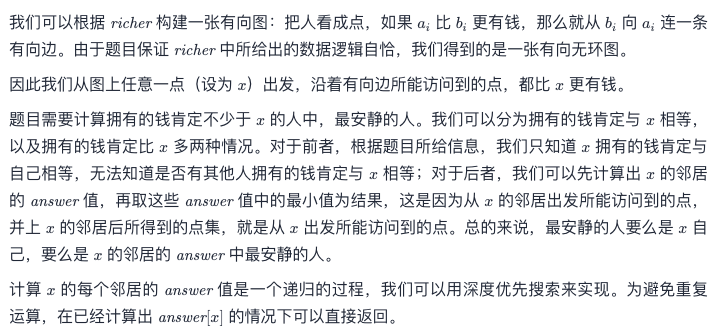
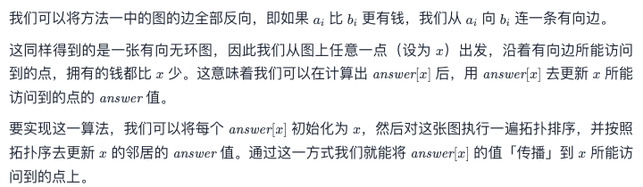

# Leetcode 每日一题 851. 喧闹和富有

## 题目描述

有一组 `n` 个人作为实验对象，从 `0` 到 `n - 1` 编号，其中每个人都有不同数目的钱，以及不同程度的安静值（quietness）。为了方便起见，我们将编号为 `x` 的人简称为 "person `x` "。

给你一个数组 `richer` ，其中 `richer[i] = [ai, bi]` 表示 person `ai` 比 person `bi` 更有钱。另给你一个整数数组 `quiet` ，其中 `quiet[i]` 是 person `i` 的安静值。`richer` 中所给出的数据 逻辑自洽（也就是说，在 person `x` 比 person `y` 更有钱的同时，不会出现 person `y` 比 person `x` 更有钱的情况 ）。

现在，返回一个整数数组 `answer` 作为答案，其中 `answer[x] = y` 的前提是，在所有拥有的钱肯定不少于 person `x` 的人中，person `y` 是最安静的人（也就是安静值 `quiet[y]` 最小的人）。

### 示例1:

```away
输入：richer = [[1,0],[2,1],[3,1],[3,7],[4,3],[5,3],[6,3]], quiet = [3,2,5,4,6,1,7,0]
输出：[5,5,2,5,4,5,6,7]
解释： 
answer[0] = 5，
person 5 比 person 3 有更多的钱，person 3 比 person 1 有更多的钱，person 1 比 person 0 有更多的钱。
唯一较为安静（有较低的安静值 quiet[x]）的人是 person 7，
但是目前还不清楚他是否比 person 0 更有钱。
answer[7] = 7，
在所有拥有的钱肯定不少于 person 7 的人中（这可能包括 person 3，4，5，6 以及 7），
最安静（有较低安静值 quiet[x]）的人是 person 7。
其他的答案也可以用类似的推理来解释。
```

### 示例2:

```away
输入：richer = [], quiet = [0]
输出：[0]
```

### 提示：

- `n == quiet.length`
- `1 <= n <= 500`
- `0 <= quiet[i] < n`
- `quiet` 的所有值 **互不相同**
- `0 <= richer.length <= n * (n - 1) / 2`
- `0 <= ai, bi < n`
- `ai != bi`
- `richer` 中的所有数对 **互不相同**
- 对 `richer` 的观察在逻辑上是一致的

链接：https://leetcode-cn.com/problems/loud-and-rich/

一句话概括题目：找到一群人中比你富有的同时比你低调的人？？！

## 我的题解

做一个dfs, 建一个二维数组用来储存，数组的第一个运算符代表每个人的编号，第二个运算符代表比对应编号人富有的人的对应编号，它的值为这些人的安静值。

然后我们通过dfs一个一个向下找到安静值最低的一个人，把这个值储存在answer数组的对应位置。最后返回这个数组。

```javascript
/**
 * @param {number[][]} richer
 * @param {number[]} quiet
 * @return {number[]}
 */
var loudAndRich = function(richer, quiet) {
    var i;//指针
    var qL = quiet.length;//人的总数
    var person = new Array(qL).fill(0);//用来储存富有的人安静值的数组
    for(i=0; i<qL; i++) {
      person[i] = [];
    }
    for(i=0; i<richer.length; i++) {
      person[richer[i][1]].push(richer[i][0]);
    }//将比“richer[i][1]”富有的人的安静值放入数组对应位置
    var answer = new Array(qL).fill(-1);
    for(i=0; i<qL; i++) {
      dfs(i, quiet, person, answer);
    }
    return answer;
};

var dfs = function(pos, quiet, person, ans) {
  if(ans[pos]!== -1) {//如果已经没有富有的人了就结束
    return;
  }
  ans[pos] = pos;
  for(var i=0; i<person[pos].length; i++) {
    dfs(person[pos][i], quiet, person, ans);//挖深度
    if(quiet[ans[pos]] > quiet[ans[person[pos][i]]]) {
      ans[pos] = ans[person[pos][i]]
    }//如果途径更加安静的人，就把当前最安静的值替换。
  }
}
```

### 运行结果：


## 官方题解

这次官方提供了两种解法

### DFS深度优先搜索

我一开始dfs写不出来，看了一点官方的解法，所以我的解法和官方解法基本一致，就不多说了。



```javascript
var loudAndRich = function(richer, quiet) {
    const n = quiet.length;
    const g = new Array(n).fill(0);
    for (let i = 0; i < n; ++i) {
        g[i] = [];
    }
    for (const r of richer) {
        g[r[1]].push(r[0]);
    }

    const ans = new Array(n).fill(-1);
    for (let i = 0; i < n; ++i) {
        dfs(i, quiet, g, ans);
    }
    return ans;
};

const dfs = (x, quiet, g, ans) => {
    if (ans[x] !== -1) {
        return;
    }
    ans[x] = x;
    for (const y of g[x]) {
        dfs(y, quiet, g, ans);
        if (quiet[ans[y]] < quiet[ans[x]]) {
            ans[x] = ans[y];
        }
    }
}

作者：LeetCode-Solution
```

### 拓扑排序：

其实我觉得和dfs大同小异，无非是一个正着找，一个反着找，用时间换空间而已。



```javascript
var loudAndRich = function(richer, quiet) {
    const n = quiet.length;
    const g = new Array(n).fill(0);
    for (let i = 0; i < n; ++i) {
        g[i] = [];
    }
    const inDeg = new Array(n).fill(0);
    for (const r of richer) {
        g[r[0]].push(r[1]);
        ++inDeg[r[1]];
    }

    const ans = new Array(n).fill(0);
    for (let i = 0; i < n; ++i) {
        ans[i] = i;
    }
    const q = [];
    for (let i = 0; i < n; ++i) {
        if (inDeg[i] === 0) {
            q.push(i);
        }
    }
    while (q.length) {
        const x = q.shift();
        for (const y of g[x]) {
            if (quiet[ans[x]] < quiet[ans[y]]) {
                ans[y] = ans[x]; // 更新 x 的邻居的答案
            }
            if (--inDeg[y] === 0) {
                q.push(y);
            }
        }
    }
    return ans;
};

作者：LeetCode-Solution
```


