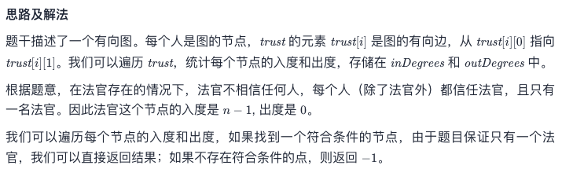

# Leetcode 每日一题 997. 找到小镇的法官

## 题目描述

在一个小镇里，按从 `1` 到 `n` 为 `n` 个人进行编号。传言称，这些人中有一个是小镇上的秘密法官。

如果小镇的法官真的存在，那么：

1. 小镇的法官不相信任何人。
2. 每个人（除了小镇法官外）都信任小镇的法官。
3. 只有一个人同时满足条件 1 和条件 2 。

给定数组 `trust`，该数组由信任对 `trust[i] = [a, b]` 组成，表示编号为 `a` 的人信任编号为 `b` 的人。

如果小镇存在秘密法官并且可以确定他的身份，请返回该法官的编号。否则，返回 `-1`。

### 示例1:

```away
输入：n = 2, trust = [[1,2]]
输出：2
```

### 示例2:

```away
输入：n = 3, trust = [[1,3],[2,3]]
输出：3
```

### 示例3:

```away
输入：n = 3, trust = [[1,3],[2,3],[3,1]]
输出：-1
```

### 示例4：

```away
输入：n = 3, trust = [[1,2],[2,3]]
输出：-1
```

## 示例5:

```away
输入：n = 4, trust = [[1,3],[1,4],[2,3],[2,4],[4,3]]
输出：3
```

### 提示：

- `1 <= n <= 1000`
- `0 <= trust.length <= 104`
- `trust[i].length == 2`
- `trust[i]` 互不相同
- `trust[i] [0] != trust[i] [1]`
- `1 <= trust[i] [0], trust[i] [1] <= n`

## 我的题解

用一个长度为n*2的二维数组，分别储存对应编号的人相信别人和被别人相信的次数

找到相信别人为0且被别人相信为n-1的人返回即可，为找到就返回-1。

```javascript
/**
 * @param {number} n
 * @param {number[][]} trust
 * @return {number}
 */
var findJudge = function(n, trust) {
    var i;
    var ans = new Array(n+1);
    for(i=0; i<n; i++) {
        ans[i] = [0, 0];
    }
    for(const guy in trust) {
        ans[guy[0]][0]++;
        ans[guy[1]][1]++;
    }
    for(i=0; i<n; i++) {
        if(ans[i][0]===0 && ans[i][1]===n-1) {
            return i+1;
        }
    }
    return -1
};
```

### 运行结果


## 官方题解

官方的说法更官方（好像是一句废话。。），这里补一下数据结构的专业名词

入度 (in-degree) ：以某顶点为弧头，终止于该顶点的弧的数目称为该顶点的入度

出度 (out-degree) ：以某顶点为弧尾，起始于该顶点的弧的数目称为该顶点的出度



```c
int findJudge(int n, int** trust, int trustSize, int* trustColSize){
    int* inDegrees = (int *)malloc(sizeof(int)*(n+1));
    int* outDegrees = (int *)malloc(sizeof(int)*(n+1));
    memset(inDegrees, 0, sizeof(int)*(n+1));
    memset(outDegrees, 0, sizeof(int)*(n+1));
    for (int i = 0; i < trustSize; ++i) {
        int x = trust[i][0], y = trust[i][1];
        ++inDegrees[y];
        ++outDegrees[x];
    }
    for (int i = 1; i <= n; ++i) {
        if (inDegrees[i] == n - 1 && outDegrees[i] == 0) {
            return i;
        }
    }
    return -1;
}

作者：LeetCode-Solution
```

