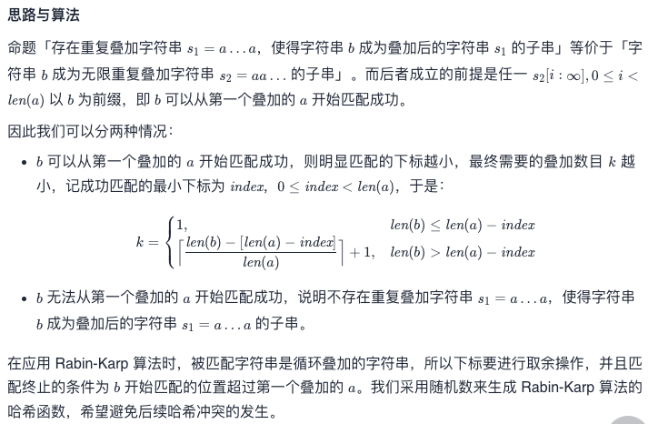
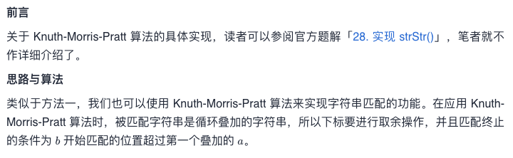

# Leetcode 每日一题 997. 找到小镇的法官

## 题目描述

给定两个字符串 `a` 和 `b`，寻找重复叠加字符串 `a` 的最小次数，使得字符串 `b` 成为叠加后的字符串 `a` 的子串，如果不存在则返回 `-1`。

注意：字符串 `"abc"` 重复叠加 0 次是 `""`，重复叠加 1 次是 `"abc"`，重复叠加 2 次是 `"abcabc"`。

### 示例1:

```away
输入：a = "abcd", b = "cdabcdab"
输出：3
解释：a 重复叠加三遍后为 "abcdabcdabcd", 此时 b 是其子串。
```

### 示例2:

```away
输入：a = "a", b = "aa"
输出：2
```

### 示例3:

```away
输入：a = "a", b = "a"
输出：1
```

### 示例4:

```away
输入：a = "abc", b = "wxyz"
输出：-1
```

### 提示：

- `1 <= a.length <= 104`
- `1 <= b.length <= 104`
- `a` 和 `b` 由小写英文字母组成

## 我的题解：

因为如果a要包含b， 那么a 一定要比b长， 我们先增加a的长度并计数增加次数，当a长度大于等于b时，开始检查a是否包含b，如果包含就返回计数的值。

因为a包含b只有几种情况

- a == b
- na == b
- a与另外一个a的中间部分=b

所以我们只需要一个长度和b差不多的由a组成的字符串，再在头和尾加上一个a，这样就可以确保所有情况都被考虑到了。

```javascript
/**
 * @param {string} a
 * @param {string} b
 * @return {number}
 */
var repeatedStringMatch = function(a, b) {
    var ans = 0;//计数器
    var area = ""//用于匹配的字符串
    while(area.length<b.length) {
        area+=a;
        ans++;
    }
    while(area.length<=b.length+2*a.length) {//演绎过程
        if(area.includes(b)) {
            return ans;
        }else {
            area+= a;
            ans++;
        }
    }
    return -1;
};
```

### 运行结果


## 官方题解

### 方法一：Rabin-Karp 算法



```c
int strStr(char *haystack, int n, char *needle, int m) {
    if (m == 0) {
        return 0;
    }

    long long k1 = 1e9 + 7;
    long long k2 = 1337;
    srand((unsigned)time(NULL));
    long long kMod1 = rand() % k1 + k1;
    long long kMod2 = rand() % k2 + k2;

    long long hash_needle = 0;
    for (int i = 0; i < m; i++) {
        hash_needle = (hash_needle * kMod2 + needle[i]) % kMod1;
    }
    long long hash_haystack = 0, extra = 1;
    for (int i = 0; i < m - 1; i++) {
        hash_haystack = (hash_haystack * kMod2 + haystack[i % n]) % kMod1;
        extra = (extra * kMod2) % kMod1;
    }
    for (int i = m - 1; (i - m + 1) < n; i++) {
        hash_haystack = (hash_haystack * kMod2 + haystack[i % n]) % kMod1;
        if (hash_haystack == hash_needle) {
            return i - m + 1;
        }
        hash_haystack = (hash_haystack - extra * haystack[(i - m + 1) % n]) % kMod1;
        hash_haystack = (hash_haystack + kMod1) % kMod1;
    }
    return -1;
}

int repeatedStringMatch(char * a, char * b){
    int an = strlen(a), bn = strlen(b);
    int index = strStr(a, an, b, bn);
    if (index == -1) {
        return -1;
    }
    if (an - index >= bn) {
        return 1;
    }
    return (bn + index - an - 1) / an + 2;
}

作者：LeetCode-Solution
```

### 方法二：Knuth-Morris-Pratt 算法



```c
int strStr(char * haystack, int n, char * needle, int m) {
    if (m == 0) {
        return 0;
    }
    int pi[m];
    pi[0] = 0;
    for (int i = 1, j = 0; i < m; i++) {
        while (j > 0 && needle[i] != needle[j]) {
            j = pi[j - 1];
        }
        if (needle[i] == needle[j]) {
            j++;
        }
        pi[i] = j;
    }
    for (int i = 0, j = 0; i - j < n; i++) { // b 开始匹配的位置是否超过第一个叠加的 a
        while (j > 0 && haystack[i % n] != needle[j]) { // haystack 是循环叠加的字符串，所以取 i % n
            j = pi[j - 1];
        }
        if (haystack[i % n] == needle[j]) {
            j++;
        }
        if (j == m) {
            return i - m + 1;
        }
    }
    return -1;
}
int repeatedStringMatch(char * a, char * b){
    int an = strlen(a), bn = strlen(b);
    int index = strStr(a, an, b, bn);
    if (index == -1) {
        return -1;
    }
    if (an - index >= bn) {
        return 1;
    }
    return (bn + index - an - 1) / an + 2;
}

作者：LeetCode-Solution
```

讲道理，这个两个算法听都没听说过

最近考试周时间比较紧，外加今天去开会了，我后面有时间再补一下理解吧！！！

